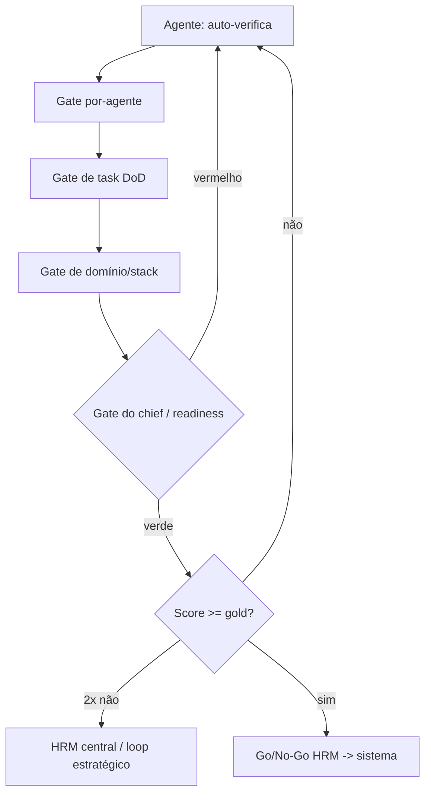

# Cascade de Quality Gates — o DAG completo

Os gates não são avulsos: eles formam uma **cascade** em 6 níveis. Nada sobe sem passar pelo nível anterior. Recuperação de cada falha em [`failure-paths-and-gate-recovery`](failure-paths-and-gate-recovery.md); mapa princípio→gate em [`principles-enforcement-map`](principles-enforcement-map.md).

## Os 6 níveis
```
N1  Auto-verificação do agente (§6)      ── Bloom até Avaliar + red-team
        │  (verde)
N2  Gate por-agente (checklists/<grupo>/) ── 5 gates por subpasta
        │
N3  Gate de task (Definition of Done)     ── cada tasks/**/*.md
        │
N4  Gate de domínio / stack               ── offer-book-stack/* · blackbook-stack/*
        │                                     (agrega N1-N3 da camada)
N5  Gate do chief (readiness)             ── chief-*-readiness-gate + ★ HARD STOP
        │                                     offer-book-dod-gate / blackbook-dod-gate
N6  Go/No-Go HRM (hrm_central)            ── readiness_rules + score >= gold -> sistema
```

## Diagrama (Offer Book → Blackbook)


## Tabela de cascade
| Nível | Dono | Exemplo de gate | Falha → volta para |
|---|---|---|---|
| N1 | agente | §6 self-verification | o próprio agente (re-executa) |
| N2 | agente | [value-no-orphan-lever-gate](../checklists/value/value-no-orphan-lever-gate.md) | agente dono |
| N3 | task | DoD em [design-money-model](../tasks/offer-architecture/design-money-model.md) | task/agente dono |
| N4 | stack | [offer-architecture-gate](../checklists/offer-book-stack/offer-architecture-gate.md) | o bloco que falhou |
| N5 | chief | [offer-book-dod-gate](../checklists/offer-book-stack/offer-book-dod-gate.md) ★ HARD STOP | a fase D1/D2/D3 correspondente |
| N6 | hrm_central | `readiness_rules` + `score_thresholds` | loop de melhoria ou aprovação sistêmica |

## Regras da cascade
- **Monotônica:** N(k) só roda se N(k-1) está verde. Nada "meio pronto" sobe.
- **HARD STOP** (N5): nenhuma copy (D4+) antes do `offer-book-dod-gate` verde.
- **Score gate** (N6): abaixo de `gold` (95) → rework; 2 loops sem gold → `hrm_central` (ver [hrm-governance](hrm-governance.md)).
- **Sem override terminal:** claim sem lastro e escassez falsa morrem no `compliance-auditor` (N4/N5), sem volta.
- **Rastreável:** toda passagem/veto é logada no [`decision-registry`](../data/registries/decision-registry.md); o score por lançamento vai para [`data/scorecards/`](../data/scorecards/README.md).

## Como rodar a cascade (operador)
`python3 scripts/qa-runner.py --strict` valida N1–N3 estruturalmente (frontmatter, seções, links, pisos). Os gates N4–N6 são editoriais (checklists + score). O [`readiness-check.py`](../scripts/readiness-check.py) avalia o go/no-go (N6) contra `score_thresholds`.
