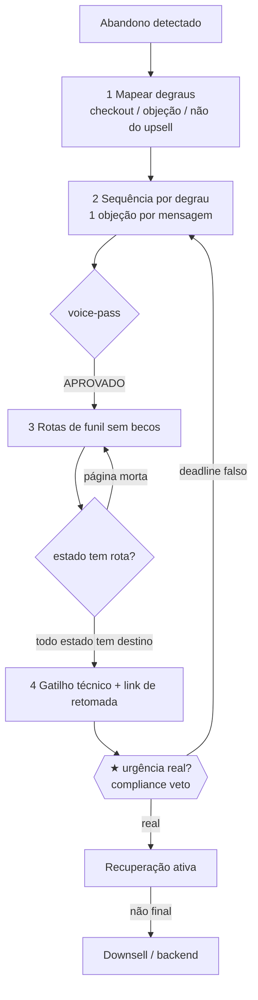

# Workflow — Recuperação de Carrinho Abandonado (nenhum "não" cai no silêncio)

## Objetivo
Recuperar a venda perdida por **degrau de abandono** — do lembrete suave do checkout interrompido, passando pela quebra da objeção que travou a compra, até o downsell que recupera margem do "não". O resultado ponta-a-ponta: a sequência de recuperação ([`launch/abandoned-cart-recovery`](../frameworks/launch/abandoned-cart-recovery.md)) com timing por degrau, o **funil que liga cada estado de abandono a uma rota** (nunca a uma página morta), e o veredito de compliance APROVADO sobre a urgência usada. Este workflow é o flanco de recuperação da janela de [`cart-open-close`](cart-open-close.md): pega quem entrou no checkout e não terminou, e quem disse "não" ao upsell. O princípio (do [`map-funnel`](../tasks/funnel-tech/map-funnel.md)): o "não" sempre tem rota, não silêncio.

## Gatilho
Inicia quando há um **fluxo de venda ativo com checkout** e o gatilho de abandono precisa de tratamento — durante a janela de carrinho ([`cart-open-close`](cart-open-close.md)) ou no funil evergreen de uma [`single-promo`](single-promo.md). Pré-condição: o money model define os degraus (o downsell de recuperação existe na escada) e as objeções estão catalogadas no [`objection-registry`](../data/registries/objection-registry.md). As sequências nascem em [`write-email-sms-sequences`](../tasks/copy/write-email-sms-sequences.md) (D4, pós-HARD STOP) e o funil em [`map-funnel`](../tasks/funnel-tech/map-funnel.md) (D5).

## Agentes
Ordenados pelo fluxo:
1. [`email-sms-sequence-writer`](../agents/email-sms-sequence-writer.md) — escreve a sequência de recuperação por degrau (uma objeção por mensagem), com supressão de quem comprou.
2. [`voice-style-guardian`](../agents/voice-style-guardian.md) — aprova a voz de cada mensagem (veto).
3. [`funnel-architect`](../agents/funnel-architect.md) — liga cada estado de abandono a uma rota; o "não" do upsell cai no downsell, nunca em página morta.
4. [`tech-links-deliverability-engineer`](../agents/tech-links-deliverability-engineer.md) — implementa o gatilho de abandono, o retry idempotente e o link de retomada do checkout.
5. [`compliance-auditor`](../agents/compliance-auditor.md) — audita a urgência da recuperação (**★ VETO** de escassez falsa).

## Mapa de Estágios

| # | Estágio | Agente(s) | Task(s) | Gates | Outputs |
|---|---|---|---|---|---|
| 1 | Mapear os degraus de abandono | [`email-sms-sequence-writer`](../agents/email-sms-sequence-writer.md) | [`write-email-sms-sequences`](../tasks/copy/write-email-sms-sequences.md) (espinha de recuperação) | `email-sms/email-step-coverage-gate` | degraus: checkout interrompido · objeção · "não" do upsell |
| 2 | Sequência de recuperação (1 objeção/degrau) | [`email-sms-sequence-writer`](../agents/email-sms-sequence-writer.md), [`voice-style-guardian`](../agents/voice-style-guardian.md) | [`write-email-sms-sequences`](../tasks/copy/write-email-sms-sequences.md) → [`voice-pass`](../tasks/copy/voice-pass.md) | [`email-sms/email-timing-gate`](../checklists/email-sms/email-timing-gate.md), `voice/voice-checklist` | mensagens por degrau + supressão |
| 3 | Rotas de funil (sem becos) | [`funnel-architect`](../agents/funnel-architect.md) | [`map-funnel`](../tasks/funnel-tech/map-funnel.md) | [`funnel/funnel-no-dead-end-gate`](../checklists/funnel/funnel-no-dead-end-gate.md), `funnel/funnel-redirect-gate` | abandono → recuperação; "não" → downsell |
| 4 | Gatilho técnico & retomada | [`tech-links-deliverability-engineer`](../agents/tech-links-deliverability-engineer.md) | [`plan-tech-deliverability`](../tasks/funnel-tech/plan-tech-deliverability.md) | `tech-deliverability-checklist` | gatilho de abandono, retry idempotente, link de retomada |
| 5 | ★ Auditoria de urgência | [`compliance-auditor`](../agents/compliance-auditor.md) | [`compliance-audit`](../tasks/qa-memory/compliance-audit.md) (escopo escassez) | [`compliance/compliance-scarcity-truth-gate`](../checklists/compliance/compliance-scarcity-truth-gate.md) **★ VETO** | `decision.compliance-verdict` |

## Diagrama

## Pontos de Decisão
- **Degrau de abandono (estágio 1):** via [`launch/abandoned-cart-recovery`](../frameworks/launch/abandoned-cart-recovery.md), cada estado tem tratamento próprio — checkout interrompido pede lembrete + link de retomada; objeção travou pede a prova que a quebra; "não" ao upsell pede o downsell. A mensagem muda por degrau.
- **Objeção por mensagem (estágio 2):** as objeções do [`objection-registry`](../data/registries/objection-registry.md) são ordenadas pela que destrava a compra; cada e-mail/SMS de recuperação ataca uma, com a prova ancorada junto.
- **Cadência da recuperação (estágio 2):** janela curta e decrescente (minutos → horas → 1 dia) durante a janela de carrinho; mais espaçada no evergreen. SMS para o lembrete imediato; e-mail para a quebra de objeção.
- **Destino do "não" final (estágio 3):** via [`offer-to-funnel-mapping`](../frameworks/offer-to-funnel-mapping.md), o "não" definitivo cai no downsell/backend da escada — nunca numa página morta. A rota de recuperação é parte do funil, não um anexo.

## Critério de Saída
O workflow completa quando **todos os gates estão verdes**: o [`email-sms/email-step-coverage-gate`](../checklists/email-sms/email-step-coverage-gate.md) (cada degrau de abandono tem mensagem), o [`email-sms/email-timing-gate`](../checklists/email-sms/email-timing-gate.md) (cadência sem colisão), o [`funnel/funnel-no-dead-end-gate`](../checklists/funnel/funnel-no-dead-end-gate.md) (todo estado de abandono/recusa tem rota), o `tech-deliverability-checklist` (gatilho e retomada implementados) e o **★ VETO** de escassez ([`compliance/compliance-scarcity-truth-gate`](../checklists/compliance/compliance-scarcity-truth-gate.md)) com `decision.compliance-verdict = APROVADO`. Estado terminal: nenhum carrinho abandonado cai no silêncio; cada degrau tem mensagem e rota; o comprador que voltou sai dos fluxos de recuperação; toda urgência usada é real. A recuperação está ligada ao funil de [`cart-open-close`](cart-open-close.md).

## Falha/Rollback
- **Degrau sem mensagem** → o [`email-sms-sequence-writer`](../agents/email-sms-sequence-writer.md) preenche o buraco de cobertura; reentra no estágio 1/2.
- **Mensagem reprovada na voz** → [`voice-pass`](../tasks/copy/voice-pass.md) devolve o redline; re-auditar no reenvio.
- **Estado de abandono em página morta** → o [`funnel-architect`](../agents/funnel-architect.md) cria a rota; o gate de "sem becos sem saída" não fica verde com silêncio.
- **Gatilho que duplica pedido** → o [`tech-links-deliverability-engineer`](../agents/tech-links-deliverability-engineer.md) corrige com retry idempotente (chave por pedido).
- **★ Urgência falsa na recuperação** → o [`compliance-auditor`](../agents/compliance-auditor.md) veta o deadline inventado e devolve ao [`email-sms-sequence-writer`](../agents/email-sms-sequence-writer.md).
- **Re-entrada:** mudança no money model (downsell) ou na janela de carrinho reabre as rotas e a cadência. Override só com `decision_id` humano explícito do [`offerbook-chief`](../agents/offerbook-chief.md) no [`decision-registry`](../data/registries/decision-registry.md).
