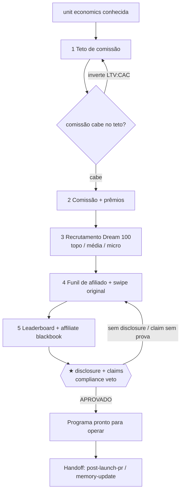

# Workflow — Lançamento com Afiliados (o exército que multiplica o alcance, com a economia fechando)

## Objetivo
Montar e operar um **programa de afiliados** onde a economia fecha, os parceiros certos são recrutados, e cada um recebe um funil pronto para promover sem fricção. O resultado ponta-a-ponta: cohorts (Dream 100, média, micro), estrutura de comissão + prêmios **dentro do teto da unit economics**, funil de afiliado, leaderboard, **affiliate blackbook** plug-and-play, e o veredito de compliance APROVADO (disclosure de afiliação em **cada** peça, escassez de fechamento verdadeira). Espelha a task [`build-affiliate-program`](../tasks/growth/build-affiliate-program.md). Roda **dentro** do [`full-launch-blackbook`](full-launch-blackbook.md), ancorado nas janelas do run-of-show e na escassez de [`cart-open-close`](cart-open-close.md). O princípio: a comissão sai do que a unit economics permite, nunca da margem que não existe.

## Gatilho
Inicia quando o [`affiliate-program-architect`](../agents/affiliate-program-architect.md) recebe o sinal de que o Offer Book está aprovado, a **unit economics é conhecida** e o [`run-of-show`](../tasks/ops/build-run-of-show.md) define as janelas (aquecimento, abertura, fechamento). Pré-condição inegociável (do gatilho da task): **sem unit economics não define comissão** — sem saber quanto vale um cliente, qualquer percentual é chute que pode quebrar a margem. Comissão que inverte o LTV:CAC → não publicar; devolver ao [`unit-economics-stack-analyst`](../agents/unit-economics-stack-analyst.md) e ao [`money-model-designer`](../agents/money-model-designer.md).

## Agentes
Ordenados pelo fluxo:
1. [`affiliate-program-architect`](../agents/affiliate-program-architect.md) — o general do exército; arquiteta cohorts, comissão, funil, leaderboard e blackbook.
2. [`unit-economics-stack-analyst`](../agents/unit-economics-stack-analyst.md) — (upstream) fornece o **teto** de comissão (LTV/CAC/payback/margem).
3. [`money-model-designer`](../agents/money-model-designer.md) — (upstream) define **sobre o quê** a comissão incide (front-end, upsell, continuidade).
4. [`launch-producer`](../agents/launch-producer.md) — (upstream) entrega as janelas em que os afiliados entram.
5. [`compliance-auditor`](../agents/compliance-auditor.md) — audita a disclosure (FTC/CDC) e os claims do swipe (**★ VETO**).
6. [`knowledge-librarian`](../agents/knowledge-librarian.md) — registra ângulos vencedores e resultados por afiliado.

## Mapa de Estágios

| # | Estágio | Agente(s) | Task(s) | Gates | Outputs |
|---|---|---|---|---|---|
| 1 | Confirmar teto econômico | [`affiliate-program-architect`](../agents/affiliate-program-architect.md), [`unit-economics-stack-analyst`](../agents/unit-economics-stack-analyst.md) | [`build-affiliate-program`](../tasks/growth/build-affiliate-program.md) (passo teto) | `unit-economics-checklist` (herdado) | teto de comissão por venda |
| 2 | Comissão + prêmios | [`affiliate-program-architect`](../agents/affiliate-program-architect.md) | [`build-affiliate-program`](../tasks/growth/build-affiliate-program.md) (ToT comissão) | [`affiliate-program-checklist`](../checklists/affiliate/affiliate-program-checklist.md) | `artifact.affiliate-prizes`, estrutura de comissão |
| 3 | Recrutamento (Dream 100) | [`affiliate-program-architect`](../agents/affiliate-program-architect.md) | [`build-affiliate-program`](../tasks/growth/build-affiliate-program.md) (ToT recrutamento) | — | cohorts (topo/média/micro) |
| 4 | Funil de afiliado + swipe | [`affiliate-program-architect`](../agents/affiliate-program-architect.md) | [`build-affiliate-program`](../tasks/growth/build-affiliate-program.md) (funil) | — | página de recrutamento → onboarding → área com links + swipe original |
| 5 | Leaderboard + blackbook | [`affiliate-program-architect`](../agents/affiliate-program-architect.md) | [`build-affiliate-program`](../tasks/growth/build-affiliate-program.md) (leaderboard/blackbook) | [`affiliate-program-checklist`](../checklists/affiliate/affiliate-program-checklist.md) | `artifact.affiliate-program`, `artifact.affiliate-blackbook` |
| 6 | ★ Compliance: disclosure + claims | [`compliance-auditor`](../agents/compliance-auditor.md) | [`compliance-audit`](../tasks/qa-memory/compliance-audit.md) (escopo afiliados) | [`compliance/compliance-claim-backing-gate`](../checklists/compliance/compliance-claim-backing-gate.md), [`compliance/compliance-scarcity-truth-gate`](../checklists/compliance/compliance-scarcity-truth-gate.md) **★ VETO** | `decision.compliance-verdict` |

## Diagrama

## Pontos de Decisão
- **Modelo de comissão (estágio 2):** ≥3 modelos via [`launch/affiliate-army`](../frameworks/launch/affiliate-army.md) — linear, tiered por volume, flat + leaderboard de prêmios — pontuados por fit econômico, poder de motivação, simplicidade e justiça percebida. O que estoura o teto é podado.
- **Sobre o que a comissão incide:** decisão herdada do [`money-model-designer`](../agents/money-model-designer.md) — só front-end, ou front-end + upsell, ou inclui continuidade. Ramifica o cálculo do teto e o discurso de recrutamento.
- **Foco do recrutamento (estágio 3):** ≥3 estratégias — poucos gigantes, médios em volume, enxame de micro — pontuadas por alcance, risco de concentração, qualidade de lead e esforço de gestão. Concentração alta ou lead de baixa qualidade é podada.
- **Leaderboard sem incentivar engano (estágio 5):** a competição motiva volume, mas inclui critério de qualidade/reembolso no ranking, para não premiar promessa enganosa que o [`compliance-auditor`](../agents/compliance-auditor.md) vetaria.

## Critério de Saída
O workflow completa quando **todos os gates estão verdes**: o [`affiliate-program-checklist`](../checklists/affiliate/affiliate-program-checklist.md) (comissão dentro do teto, cohorts definidas, funil pronto com links/swipe/datas, disclosure em toda peça, leaderboard sem engano) e o **★ VETO** de compliance ([`compliance/compliance-claim-backing-gate`](../checklists/compliance/compliance-claim-backing-gate.md) + [`compliance/compliance-scarcity-truth-gate`](../checklists/compliance/compliance-scarcity-truth-gate.md)) com `decision.compliance-verdict = APROVADO`. Estado terminal: a comissão cabe na economia (LTV:CAC saudável após pagar afiliados), o affiliate blackbook é plug-and-play, cada peça de swipe carrega a disclosure de afiliação obrigatória e usa escassez de fechamento **verdadeira** (alinhada a [`cart-open-close`](cart-open-close.md)). O swipe vai para o [`swipe-registry`](../data/registries/swipe-registry.md) em **redação original** (estrutura/princípios, nunca copy literal).

## Falha/Rollback
- **Comissão que inverte o LTV:CAC** → **não publicar**; devolve ao [`unit-economics-stack-analyst`](../agents/unit-economics-stack-analyst.md) e ao [`money-model-designer`](../agents/money-model-designer.md); reentra no estágio 1.
- **Funil sem disclosure** → o [`affiliate-program-architect`](../agents/affiliate-program-architect.md) adiciona a disclosure em cada peça antes do compliance; reentra no estágio 4.
- **Swipe com claim sem prova** → aplica [`proof-to-claim-chain`](../frameworks/proof-to-claim-chain.md); claim sem lastro sai do swipe (o afiliado só afirma o que o Offer Book provou).
- **★ VETO de compliance** → afiliado que promete resultado sem prova, ou peça sem disclosure → volta ao dono do swipe; o veto é absoluto.
- **Handoff:** os parceiros de topo (Dream 100) seguem para [`post-launch-pr`](post-launch-pr.md) como multiplicadores de PR; resultados por afiliado e ângulos vencedores vão à [`memory-update`](../tasks/qa-memory/memory-update.md). Re-entrada: mudança de janela do run-of-show reabre o onboarding e o swipe de fechamento.
