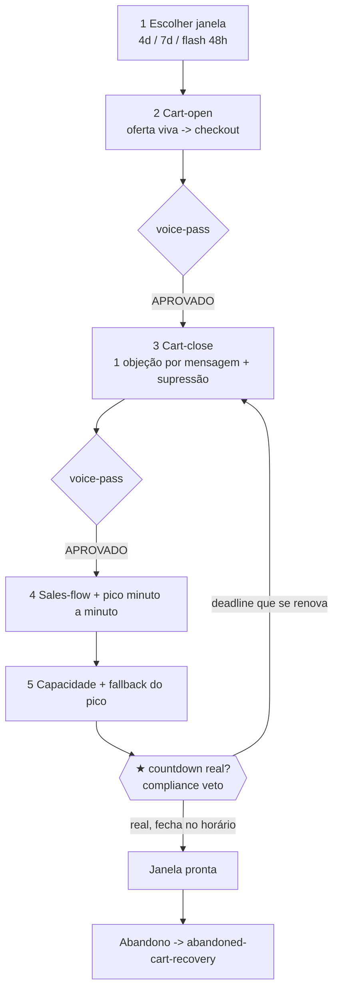

# Workflow — Abertura e Fechamento de Carrinho (a janela crítica, com urgência 100% real)

## Objetivo
Coreografar a **janela de venda do início ao fim** — abrir o carrinho, sustentar a urgência com um countdown **verdadeiro**, atacar uma objeção por mensagem no fechamento, e fechar **de verdade** no horário. O resultado ponta-a-ponta: a sequência de cart-open e cart-close ([`launch/cart-open-close`](../frameworks/launch/cart-open-close.md)) com timing por mensagem, o sales-flow das ondas de venda, o plano de surge do pico de fechamento, e o veredito de compliance APROVADO sobre cada deadline. Este workflow é a janela que a pista de [`pre-launch-runway`](pre-launch-runway.md) prepara e antecede a [`abandoned-cart-recovery`](abandoned-cart-recovery.md). O princípio inegociável (`truthful_scarcity`): toda escassez/urgência é real — deadline que de fato fecha, vaga que de fato esgota — ou o [`compliance-auditor`](../agents/compliance-auditor.md) veta.

## Gatilho
Inicia quando a pista de pré-lançamento está pronta (Fases I–IV concluídas) e o caso entra na **abertura de carrinho** — o [`launch-producer`](../agents/launch-producer.md) crava a janela no run-of-show. Pré-condição (do gatilho de [`build-run-of-show`](../tasks/ops/build-run-of-show.md)): o carrinho **não abre** sem o e-mail de fechamento pronto (queima a janela de urgência); e a capacidade de pico precisa estar confirmada no tech-plan. As sequências de carrinho já nasceram em [`write-email-sms-sequences`](../tasks/copy/write-email-sms-sequences.md) (D4, pós-HARD STOP) e foram aprovadas na voz.

## Agentes
Ordenados pelo fluxo:
1. [`launch-producer`](../agents/launch-producer.md) — escolhe a janela, coreografa o sales-flow e o pico minuto a minuto, planeja o surge.
2. [`email-sms-sequence-writer`](../agents/email-sms-sequence-writer.md) — escreve/ajusta a sequência de cart-open e cart-close (uma objeção por mensagem) e a supressão (comprador sai da venda).
3. [`voice-style-guardian`](../agents/voice-style-guardian.md) — aprova a voz de cada mensagem (veto).
4. [`tech-links-deliverability-engineer`](../agents/tech-links-deliverability-engineer.md) — confirma capacidade do pico, cadência dentro do limite de envio e fallback (link reserva, página espelho).
5. [`compliance-auditor`](../agents/compliance-auditor.md) — audita cada countdown/deadline contra a realidade (**★ VETO** de escassez falsa).

## Mapa de Estágios

| # | Estágio | Agente(s) | Task(s) | Gates | Outputs |
|---|---|---|---|---|---|
| 1 | Escolher a janela de carrinho | [`launch-producer`](../agents/launch-producer.md) | [`build-run-of-show`](../tasks/ops/build-run-of-show.md) (ToT janela) | — | `decision` da janela (4d/7d/flash 48h) |
| 2 | Sequência de cart-open | [`email-sms-sequence-writer`](../agents/email-sms-sequence-writer.md), [`voice-style-guardian`](../agents/voice-style-guardian.md) | [`write-email-sms-sequences`](../tasks/copy/write-email-sms-sequences.md) → [`voice-pass`](../tasks/copy/voice-pass.md) | `email-sms/email-step-coverage-gate`, `voice/voice-checklist` | mensagens de abertura (oferta viva → VSL/checkout) |
| 3 | Sequência de cart-close (1 objeção/msg) | [`email-sms-sequence-writer`](../agents/email-sms-sequence-writer.md), [`voice-style-guardian`](../agents/voice-style-guardian.md) | [`write-email-sms-sequences`](../tasks/copy/write-email-sms-sequences.md) → [`voice-pass`](../tasks/copy/voice-pass.md) | [`cart-close-checklist`](../checklists/cart-close-checklist.md), [`email-sms/email-timing-gate`](../checklists/email-sms/email-timing-gate.md) | mensagens de fechamento + supressão de comprador |
| 4 | Sales-flow & pico minuto a minuto | [`launch-producer`](../agents/launch-producer.md) | [`build-run-of-show`](../tasks/ops/build-run-of-show.md) | [`launch/launch-surge-gate`](../checklists/launch/launch-surge-gate.md) | `artifact.sales-flow` (ondas + gatilhos de escassez reais) |
| 5 | Capacidade & fallback do pico | [`tech-links-deliverability-engineer`](../agents/tech-links-deliverability-engineer.md) | [`plan-tech-deliverability`](../tasks/funnel-tech/plan-tech-deliverability.md) | [`launch/launch-fallback-gate`](../checklists/launch/launch-fallback-gate.md) | link reserva, página espelho, teto de envio |
| 6 | ★ Auditoria do countdown | [`compliance-auditor`](../agents/compliance-auditor.md) | [`compliance-audit`](../tasks/qa-memory/compliance-audit.md) (escopo escassez) | [`compliance/compliance-scarcity-truth-gate`](../checklists/compliance/compliance-scarcity-truth-gate.md) **★ VETO** | `decision.compliance-verdict` |

## Diagrama

## Pontos de Decisão
- **Largura da janela (estágio 1):** ≥3 opções (4 dias com cadência crescente, 7 dias, flash 48h) pontuadas por urgência verdadeira sustentável, fadiga de lista, receita projetada e fôlego de suporte. Janela que cria urgência que não se consegue honrar é podada.
- **Cadência do fechamento (estágio 3):** suave/padrão/agressiva via [`launch/cart-open-close`](../frameworks/launch/cart-open-close.md) e [`copy/close-frameworks`](../frameworks/copy/close-frameworks.md). SMS para o lembrete de últimas horas; e-mail para o conteúdo. A escolha respeita o limite de envio do tech-plan.
- **Tipo de countdown (estágio 4):** deadline de data fixa, vagas limitadas (ancoradas no inventory tracker) ou lote por preço. Via [`scarcity-urgency-engine`](../frameworks/scarcity-urgency-engine.md), só entra o que é verificável; um deadline que se renova sozinho é proibido.
- **Pico de fechamento (estágio 5):** a última noite concentra tráfego; o teto de envio e o gatilho de fallback são definidos. O e-mail de "deadline estendido por instabilidade" só existe **se a instabilidade for real**.

## Critério de Saída
O workflow completa quando **todos os gates estão verdes**: o [`cart-close-checklist`](../checklists/cart-close-checklist.md) (sequência de fechamento coerente, uma objeção por mensagem, comprador suprimido), o [`email-sms/email-timing-gate`](../checklists/email-sms/email-timing-gate.md) (sem colisão de timing), o [`launch/launch-surge-gate`](../checklists/launch/launch-surge-gate.md) e o [`launch/launch-fallback-gate`](../checklists/launch/launch-fallback-gate.md) (capacidade e plano B do pico), e o **★ VETO** de escassez ([`compliance/compliance-scarcity-truth-gate`](../checklists/compliance/compliance-scarcity-truth-gate.md)) com `decision.compliance-verdict = APROVADO`. Estado terminal: a janela está coreografada minuto a minuto, cada countdown é real e fecha no horário, o comprador sai dos fluxos de venda, e o gatilho de abandono está ligado à [`abandoned-cart-recovery`](abandoned-cart-recovery.md). Nenhum deadline falso entra na operação.

## Falha/Rollback
- **Carrinho abriria sem o e-mail de fechamento** → o [`launch-producer`](../agents/launch-producer.md) **recusa** abrir; reentra no estágio 3.
- **Colisão/buraco de timing** → o [`email-sms-sequence-writer`](../agents/email-sms-sequence-writer.md) redistribui com o tech-engineer; reentra no estágio 3/4.
- **Capacidade de pico não confirmada** → o [`launch-producer`](../agents/launch-producer.md) escala ao chief e ao [`tech-links-deliverability-engineer`](../agents/tech-links-deliverability-engineer.md) antes de marcar a data (estágio 5).
- **★ Countdown falso** → o [`compliance-auditor`](../agents/compliance-auditor.md) veta o deadline que se renova ou a "última vaga" sem lastro no tracker, e devolve ao [`launch-producer`](../agents/launch-producer.md) ou ao [`events-logistics-coordinator`](../agents/events-logistics-coordinator.md) para reancorar.
- **Re-entrada:** mudar a data de fechamento reabre o sales-flow, o pico e a auditoria de escassez. Override só com `decision_id` humano explícito do [`offerbook-chief`](../agents/offerbook-chief.md) no [`decision-registry`](../data/registries/decision-registry.md) — a lei de escassez nunca é dispensada.
