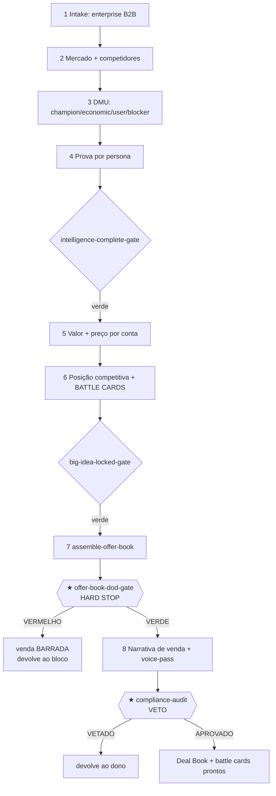

# Workflow — Enterprise Deal Book (variante B2B)

## Objetivo
Levar uma oferta B2B do briefing ao **Deal Book aprovado com battle cards** — o pacote estratégico que arma um time de vendas para um ciclo longo, com **comitê de compra (DMU)**, e a copy-âncora (VSL/sales narrative) que sustenta a conversa de venda. O resultado ponta-a-ponta: um Offer Book adaptado ao B2B (posição competitiva travada, preço por valor para conta, prova mapeada a cada objeção do comitê), **battle cards** por concorrente e por persona do comitê, a VSL/narrativa de venda e o veredito de compliance APROVADO. Espelha o composite `run-enterprise-deal-book` do [`config.yaml`](../config.yaml) — que **poda** a geração de Big Idea de massa e o money model de funil curto, e em troca aprofunda inteligência de comitê, posicionamento e prova. A disciplina do **★ HARD STOP** ([`offer-book-stack/offer-book-dod-gate`](../checklists/offer-book-stack/offer-book-dod-gate.md)) permanece: nenhuma peça de venda nasce antes da oferta provar valor.

## Gatilho
Inicia quando o [`offerbook-chief`](../agents/offerbook-chief.md) classifica o project type como **enterprise-deal-book** em [`intake-and-scope`](../tasks/planning/intake-and-scope.md). Rubrica de escolha (da própria task): B2B com **comitê** (vários decisores), ticket alto, ciclo de venda longo, decisão por consenso. Pré-condição: existe um briefing com os papéis do comitê e o cenário competitivo. O [`offer-squad-architect`](../agents/offer-squad-architect.md) desenha o pipeline B2B em [`design-pipeline`](../tasks/planning/design-pipeline.md): mantém D1–D3 (com foco em DMU e posicionamento), adiciona o entregável **battle cards**, e poda ops/eventos/afiliados/PR de massa.

## Agentes
Ordenados pelo fluxo: [`offerbook-chief`](../agents/offerbook-chief.md) → [`offer-squad-architect`](../agents/offer-squad-architect.md) → [`market-sophistication-analyst`](../agents/market-sophistication-analyst.md) → [`avatar-voc-investigator`](../agents/avatar-voc-investigator.md) (mapeia o **DMU**: economic buyer, champion, user, blocker) → [`proof-credibility-curator`](../agents/proof-credibility-curator.md) → [`value-equation-engineer`](../agents/value-equation-engineer.md) (veto) → [`pricing-wtp-strategist`](../agents/pricing-wtp-strategist.md) (valor por conta) → [`unit-economics-stack-analyst`](../agents/unit-economics-stack-analyst.md) → [`positioning-lead-strategist`](../agents/positioning-lead-strategist.md) (posição competitiva + battle cards) → [`offerbook-chief`](../agents/offerbook-chief.md) + [`compliance-auditor`](../agents/compliance-auditor.md) (**★ HARD STOP**) → [`vsl-webinar-scriptwriter`](../agents/vsl-webinar-scriptwriter.md) → [`voice-style-guardian`](../agents/voice-style-guardian.md) → [`compliance-auditor`](../agents/compliance-auditor.md) (veto final).

## Mapa de Estágios

| # | Estágio | Agente(s) | Task(s) | Gates | Outputs |
|---|---|---|---|---|---|
| 1 | Intake & pipeline B2B | [`offerbook-chief`](../agents/offerbook-chief.md), [`offer-squad-architect`](../agents/offer-squad-architect.md) | [`intake-and-scope`](../tasks/planning/intake-and-scope.md), [`design-pipeline`](../tasks/planning/design-pipeline.md) | `chief/chief-project-type-gate`, `chief/chief-scope-approval-gate` | `decision.project-type = enterprise-deal-book` |
| 2 | Mercado | [`market-sophistication-analyst`](../agents/market-sophistication-analyst.md) | [`run-market-intel`](../tasks/intelligence/run-market-intel.md) | `market/market-sophistication-gate`, `market/market-competitor-evidence-gate` | `artifact.market-brief` |
| 3 | DMU & objeções do comitê | [`avatar-voc-investigator`](../agents/avatar-voc-investigator.md) | [`build-avatar-voc`](../tasks/intelligence/build-avatar-voc.md) | `avatar/avatar-voc-verbatim-gate`, `avatar/avatar-objection-map-gate` | `artifact.avatar-icp` (DMU), objeções por persona |
| 4 | Prova por persona | [`proof-credibility-curator`](../agents/proof-credibility-curator.md) | [`curate-proof`](../tasks/intelligence/curate-proof.md) | `proof/proof-claim-backing-gate` → [`intelligence-complete-gate`](../checklists/offer-book-stack/intelligence-complete-gate.md) | `artifact.proof-bank` |
| 5 | Valor + preço por conta | [`value-equation-engineer`](../agents/value-equation-engineer.md), [`pricing-wtp-strategist`](../agents/pricing-wtp-strategist.md), [`unit-economics-stack-analyst`](../agents/unit-economics-stack-analyst.md) | [`score-value-equation`](../tasks/offer-architecture/score-value-equation.md), [`set-pricing-wtp`](../tasks/offer-architecture/set-pricing-wtp.md), [`model-unit-economics`](../tasks/offer-architecture/model-unit-economics.md) | `value/value-no-orphan-lever-gate`, [`pricing/pricing-value-derived-gate`](../checklists/pricing/pricing-value-derived-gate.md) | `artifact.value-equation`, `artifact.pricing-wtp-sheet` |
| 6 | Posição competitiva + battle cards | [`positioning-lead-strategist`](../agents/positioning-lead-strategist.md) | [`lock-positioning-lead`](../tasks/big-idea/lock-positioning-lead.md) | [`positioning/positioning-awareness-fit`](../checklists/positioning/positioning-awareness-fit.md) → [`big-idea-locked-gate`](../checklists/offer-book-stack/big-idea-locked-gate.md) | `artifact.positioning`, `artifact.battle-cards`, `decision.lead-type-locked` |
| 7 | ★ Montagem + HARD STOP | [`offerbook-chief`](../agents/offerbook-chief.md), [`compliance-auditor`](../agents/compliance-auditor.md) | [`assemble-offer-book`](../tasks/assembly/assemble-offer-book.md) | [`offer-book-stack/offer-book-dod-gate`](../checklists/offer-book-stack/offer-book-dod-gate.md) **★ HARD STOP**, `chief/chief-offer-book-readiness-gate` | `artifact.offer-book`, `decision.hard-stop-status` |
| 8 | Narrativa de venda (VSL/sales) | [`vsl-webinar-scriptwriter`](../agents/vsl-webinar-scriptwriter.md), [`voice-style-guardian`](../agents/voice-style-guardian.md) | [`write-vsl-webinar`](../tasks/copy/write-vsl-webinar.md) → [`voice-pass`](../tasks/copy/voice-pass.md) | `vsl/vsl-value-before-price-gate`, `voice/voice-checklist` | `artifact.vsl-script`, `artifact.sales-letter` |
| 9 | ★ Compliance (VETO) | [`compliance-auditor`](../agents/compliance-auditor.md), [`offerbook-chief`](../agents/offerbook-chief.md) | [`compliance-audit`](../tasks/qa-memory/compliance-audit.md) | [`compliance/compliance-claim-backing-gate`](../checklists/compliance/compliance-claim-backing-gate.md), `compliance/compliance-scarcity-truth-gate` **★ VETO** | `decision.compliance-verdict` |

## Diagrama

## Pontos de Decisão
- **Mapa do DMU (estágio 3):** via [`avatar-voc-investigator/dmu-mapping-b2b`](../frameworks/avatar-voc-investigator/dmu-mapping-b2b.md), cada persona do comitê (economic buyer, champion, usuário, blocker) recebe sua dor, seu critério de decisão e sua objeção dominante. Isso ramifica os battle cards e a prova por persona — o champion precisa de munição interna; o economic buyer, de ROI; o blocker, de mitigação de risco.
- **Posicionamento competitivo (estágio 6):** via [`dunford-positioning`](../frameworks/positioning/dunford-positioning.md) e [`moore-positioning-formula`](../frameworks/positioning/moore-positioning-formula.md). A escolha entre "vencer na categoria existente" ou "criar categoria" ([`category-design`](../frameworks/positioning/category-design.md)) define o eixo dos battle cards (comparação direta vs reframe da categoria).
- **Preço por valor de conta (estágio 5):** via [`pricing/value-based-pricing`](../frameworks/pricing/value-based-pricing.md), o preço deriva do valor para a conta (ROI, custo do problema), não de tabela — ramifica a justificativa do battle card de preço.
- **Lead da narrativa:** o lead travado em [`lock-positioning-lead`](../tasks/big-idea/lock-positioning-lead.md) decide se a VSL abre por problema (mercado menos consciente) ou por diferenciação competitiva (mercado que já compara fornecedores).

## Critério de Saída
O workflow completa quando **todos os gates estão verdes**: os agregadores [`intelligence-complete-gate`](../checklists/offer-book-stack/intelligence-complete-gate.md) e [`big-idea-locked-gate`](../checklists/offer-book-stack/big-idea-locked-gate.md), o **★ HARD STOP** ([`offer-book-stack/offer-book-dod-gate`](../checklists/offer-book-stack/offer-book-dod-gate.md)), os gates de VSL/voz, e o **★ VETO** de compliance com `decision.compliance-verdict = APROVADO`. Estado terminal: o Deal Book com os 10 blocos preenchidos e adaptados ao B2B; **battle cards** por concorrente e por persona do DMU, cada claim com prova catalogada; o preço por valor de conta com método declarado; a narrativa de venda aprovada na voz. O pacote arma o time de vendas sem que ninguém precise improvisar. Não existe estado "parcial liberado".

## Falha/Rollback
- **DMU incompleto** → volta ao [`build-avatar-voc`](../tasks/intelligence/build-avatar-voc.md): faltou mapear uma persona do comitê (ex.: o blocker sem objeção catalogada).
- **Claim de battle card sem prova** → o [`proof-credibility-curator`](../agents/proof-credibility-curator.md) preenche o lastro antes do gate de posicionamento; battle card só afirma o que a prova sustenta.
- **★ HARD STOP vermelho** → o [`assemble-offer-book`](../tasks/assembly/assemble-offer-book.md) barra a narrativa de venda e devolve ao dono do bloco (preço sem método → [`pricing-wtp-strategist`](../agents/pricing-wtp-strategist.md); componente órfão → [`value-equation-engineer`](../agents/value-equation-engineer.md)).
- **★ VETO de compliance** → claim de ROI sem lastro ou comparação competitiva injusta volta ao autor; em B2B, claim comparativo exige prova ainda mais rígida.
- **Reabertura:** mudança em preço, posição ou prova reabre o HARD STOP e invalida battle cards e narrativa já feitos. Override só com `decision_id` humano explícito do [`offerbook-chief`](../agents/offerbook-chief.md) no [`decision-registry`](../data/registries/decision-registry.md).
