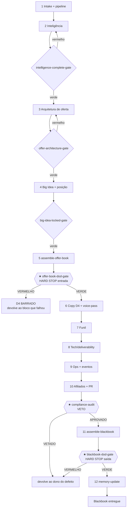

# Workflow — Lançamento Completo até o Launch Blackbook (★ dois HARD STOPS)

## Objetivo
Levar um caso do briefing cru ao **Launch Blackbook entregue** — o pacote final navegável que um operador executa sem precisar perguntar nada. É o pipeline completo do squad em 12 estágios: do intake à memorialização, passando por inteligência, arquitetura de oferta, Big Idea, copy, funil, tech, ops, eventos, afiliados, PR, compliance e blackbook. Espelha o composite `run-full-launch` do [`config.yaml`](../config.yaml). O resultado ponta-a-ponta tem **dois portões inegociáveis**: o **★ HARD STOP de entrada** ([`offer-book-stack/offer-book-dod-gate`](../checklists/offer-book-stack/offer-book-dod-gate.md)) que barra a copy antes da oferta provar valor, e o **★ HARD STOP de saída** ([`blackbook-stack/blackbook-dod-gate`](../checklists/blackbook-stack/blackbook-dod-gate.md)) que barra a entrega antes do pacote estar completo e conforme. Entre os dois, o **VETO de compliance** ([`compliance-audit`](../tasks/qa-memory/compliance-audit.md)) pode parar qualquer claim sem lastro ou escassez falsa.

## Gatilho
Inicia quando o [`offerbook-chief`](../agents/offerbook-chief.md) classifica o project type como **full-launch** em [`intake-and-scope`](../tasks/planning/intake-and-scope.md) — oferta provada, mercado quente, meta de receita que justifica a escada completa, o evento de venda e o exército de afiliados. Pré-condição: existe um briefing e, idealmente, um handoff de pesquisa do deepresearch squad (market sizing + VOC + competitor intel). O [`offer-squad-architect`](../agents/offer-squad-architect.md) desenha o grafo do caso em [`design-pipeline`](../tasks/planning/design-pipeline.md), posicionando os dois HARD STOPS e o VETO.

## Agentes
Todos os 25 agentes do squad participam, ordenados pelo fluxo:
1. **Comando (D0):** [`offerbook-chief`](../agents/offerbook-chief.md) → [`offer-squad-architect`](../agents/offer-squad-architect.md).
2. **Inteligência (D1):** [`market-sophistication-analyst`](../agents/market-sophistication-analyst.md) → [`avatar-voc-investigator`](../agents/avatar-voc-investigator.md) → [`proof-credibility-curator`](../agents/proof-credibility-curator.md).
3. **Arquitetura de oferta (D2):** [`mechanism-architect`](../agents/mechanism-architect.md) → [`value-equation-engineer`](../agents/value-equation-engineer.md) → [`pricing-wtp-strategist`](../agents/pricing-wtp-strategist.md) → [`unit-economics-stack-analyst`](../agents/unit-economics-stack-analyst.md) → [`money-model-designer`](../agents/money-model-designer.md).
4. **Big Idea & posição (D3):** [`big-idea-architect`](../agents/big-idea-architect.md) → [`positioning-lead-strategist`](../agents/positioning-lead-strategist.md).
5. **Copy & criativo (D4):** [`vsl-webinar-scriptwriter`](../agents/vsl-webinar-scriptwriter.md) · [`email-sms-sequence-writer`](../agents/email-sms-sequence-writer.md) · [`direct-mail-insert-writer`](../agents/direct-mail-insert-writer.md) · [`ad-creative-factory`](../agents/ad-creative-factory.md) → [`voice-style-guardian`](../agents/voice-style-guardian.md) (veto de voz).
6. **Funil & tech (D5):** [`funnel-architect`](../agents/funnel-architect.md) → [`tech-links-deliverability-engineer`](../agents/tech-links-deliverability-engineer.md).
7. **Ops & growth (D6):** [`launch-producer`](../agents/launch-producer.md) → [`events-logistics-coordinator`](../agents/events-logistics-coordinator.md) → [`affiliate-program-architect`](../agents/affiliate-program-architect.md) → [`pr-brand-strategist`](../agents/pr-brand-strategist.md).
8. **QA & memória (D7):** [`compliance-auditor`](../agents/compliance-auditor.md) (veto) → [`knowledge-librarian`](../agents/knowledge-librarian.md).

## Mapa de Estágios

| # | Estágio | Agente(s) | Task(s) | Gates | Outputs |
|---|---|---|---|---|---|
| 1 | Intake & pipeline | [`offerbook-chief`](../agents/offerbook-chief.md), [`offer-squad-architect`](../agents/offer-squad-architect.md) | [`intake-and-scope`](../tasks/planning/intake-and-scope.md), [`design-pipeline`](../tasks/planning/design-pipeline.md) | `chief/chief-project-type-gate`, `chief/chief-scope-approval-gate` | `decision.project-type`, `decision.scope-one-sentence` |
| 2 | Inteligência | [`market-sophistication-analyst`](../agents/market-sophistication-analyst.md), [`avatar-voc-investigator`](../agents/avatar-voc-investigator.md), [`proof-credibility-curator`](../agents/proof-credibility-curator.md) | [`run-market-intel`](../tasks/intelligence/run-market-intel.md), [`build-avatar-voc`](../tasks/intelligence/build-avatar-voc.md), [`curate-proof`](../tasks/intelligence/curate-proof.md) | `market/market-sophistication-gate`, `avatar/avatar-voc-verbatim-gate`, `proof/proof-claim-backing-gate` → [`intelligence-complete-gate`](../checklists/offer-book-stack/intelligence-complete-gate.md) | `artifact.market-brief`, `artifact.avatar-icp`, `artifact.proof-bank` |
| 3 | Arquitetura de oferta | [`mechanism-architect`](../agents/mechanism-architect.md), [`value-equation-engineer`](../agents/value-equation-engineer.md), [`pricing-wtp-strategist`](../agents/pricing-wtp-strategist.md), [`unit-economics-stack-analyst`](../agents/unit-economics-stack-analyst.md), [`money-model-designer`](../agents/money-model-designer.md) | [`define-mechanism`](../tasks/offer-architecture/define-mechanism.md), [`score-value-equation`](../tasks/offer-architecture/score-value-equation.md), [`set-pricing-wtp`](../tasks/offer-architecture/set-pricing-wtp.md), [`model-unit-economics`](../tasks/offer-architecture/model-unit-economics.md), [`design-money-model`](../tasks/offer-architecture/design-money-model.md) | `mechanism/mechanism-naming-gate`, `value/value-no-orphan-lever-gate`, [`money-model/money-model-four-parts-gate`](../checklists/money-model/money-model-four-parts-gate.md) → [`offer-architecture-gate`](../checklists/offer-book-stack/offer-architecture-gate.md) | `artifact.mechanism-sheet`, `artifact.value-equation`, `artifact.money-model` |
| 4 | Big Idea & posição | [`big-idea-architect`](../agents/big-idea-architect.md), [`positioning-lead-strategist`](../agents/positioning-lead-strategist.md) | [`generate-big-ideas`](../tasks/big-idea/generate-big-ideas.md), [`lock-positioning-lead`](../tasks/big-idea/lock-positioning-lead.md) | `big-idea/big-idea-single-gate` → [`big-idea-locked-gate`](../checklists/offer-book-stack/big-idea-locked-gate.md) | `artifact.big-idea`, `artifact.positioning`, `decision.lead-type-locked` |
| 5 | ★ Montagem + HARD STOP de entrada | [`offerbook-chief`](../agents/offerbook-chief.md), [`compliance-auditor`](../agents/compliance-auditor.md) | [`assemble-offer-book`](../tasks/assembly/assemble-offer-book.md) | [`offer-book-stack/offer-book-dod-gate`](../checklists/offer-book-stack/offer-book-dod-gate.md) **★ HARD STOP**, `chief/chief-offer-book-readiness-gate` | `artifact.offer-book`, `decision.hard-stop-status` |
| 6 | Copy & criativo (D4) | [`vsl-webinar-scriptwriter`](../agents/vsl-webinar-scriptwriter.md), [`email-sms-sequence-writer`](../agents/email-sms-sequence-writer.md), [`direct-mail-insert-writer`](../agents/direct-mail-insert-writer.md), [`ad-creative-factory`](../agents/ad-creative-factory.md), [`voice-style-guardian`](../agents/voice-style-guardian.md) | [`write-vsl-webinar`](../tasks/copy/write-vsl-webinar.md), [`write-email-sms-sequences`](../tasks/copy/write-email-sms-sequences.md), [`write-mailers-inserts`](../tasks/copy/write-mailers-inserts.md), [`generate-ad-matrix`](../tasks/copy/generate-ad-matrix.md), [`voice-pass`](../tasks/copy/voice-pass.md) | `vsl/vsl-value-before-price-gate`, `email-sms/email-step-coverage-gate`, `voice/voice-checklist` → `decision.voice-verdict` | `artifact.vsl-script`, `artifact.email-sms-sequences`, `artifact.mailers-inserts`, `artifact.ad-matrix` |
| 7 | Funil (D5) | [`funnel-architect`](../agents/funnel-architect.md) | [`map-funnel`](../tasks/funnel-tech/map-funnel.md) | [`funnel/funnel-no-dead-end-gate`](../checklists/funnel/funnel-no-dead-end-gate.md), `funnel/funnel-backend-gate` | `artifact.funnel-map`, `artifact.page-specs` |
| 8 | Tech & deliverability (D5) | [`tech-links-deliverability-engineer`](../agents/tech-links-deliverability-engineer.md) | [`plan-tech-deliverability`](../tasks/funnel-tech/plan-tech-deliverability.md) | `tech-deliverability-checklist`, [`launch/launch-fallback-gate`](../checklists/launch/launch-fallback-gate.md) | `artifact.links-urls`, `artifact.tech-deliverability-plan` |
| 9 | Ops & eventos (D6) | [`launch-producer`](../agents/launch-producer.md), [`events-logistics-coordinator`](../agents/events-logistics-coordinator.md) | [`build-launch-memo`](../tasks/ops/build-launch-memo.md), [`build-run-of-show`](../tasks/ops/build-run-of-show.md), [`build-events-logistics`](../tasks/ops/build-events-logistics.md) | [`launch/launch-phase-readiness-gate`](../checklists/launch/launch-phase-readiness-gate.md), `launch/launch-surge-gate`, `events-logistics-checklist` | `artifact.run-of-show`, `artifact.events-calendar` |
| 10 | Afiliados & PR (D6) | [`affiliate-program-architect`](../agents/affiliate-program-architect.md), [`pr-brand-strategist`](../agents/pr-brand-strategist.md) | [`build-affiliate-program`](../tasks/growth/build-affiliate-program.md), [`build-pr-plan`](../tasks/growth/build-pr-plan.md) | `affiliate-program-checklist`, `pr-plan-checklist` | `artifact.affiliate-program`, `artifact.pr-plan` |
| 11 | ★ Compliance (VETO) + Blackbook (HARD STOP de saída) | [`compliance-auditor`](../agents/compliance-auditor.md), [`offerbook-chief`](../agents/offerbook-chief.md) | [`compliance-audit`](../tasks/qa-memory/compliance-audit.md), [`assemble-blackbook`](../tasks/qa-memory/assemble-blackbook.md) | [`compliance/compliance-claim-backing-gate`](../checklists/compliance/compliance-claim-backing-gate.md), [`compliance/compliance-scarcity-truth-gate`](../checklists/compliance/compliance-scarcity-truth-gate.md) **★ VETO**, [`blackbook-stack/blackbook-dod-gate`](../checklists/blackbook-stack/blackbook-dod-gate.md) **★ HARD STOP**, `chief/chief-blackbook-readiness-gate` | `decision.compliance-verdict`, `artifact.launch-blackbook` |
| 12 | Memória | [`knowledge-librarian`](../agents/knowledge-librarian.md) | [`memory-update`](../tasks/qa-memory/memory-update.md) | `final-delivery-checklist` | `registry.control-update`, `registry.swipe-update`, `registry.lessons-learned-update` |

## Diagrama

## Pontos de Decisão
- **Sofisticação do mercado (1–5):** trava no estágio 2 via [`awareness-x-sophistication`](../frameworks/awareness-x-sophistication.md). Mercado saturado (4–5) força mecanismo único forte no estágio 3 e nova identificação na Big Idea do estágio 4. Mercado virgem (1–2) vende o benefício direto.
- **Consciência (Schwartz):** decide o lead em [`lock-positioning-lead`](../tasks/big-idea/lock-positioning-lead.md). Inconsciente → lead de história/problema na VSL; mais consciente → lead de oferta/prova. O lead travado é contrato para todo o D4 e ramifica os ganchos dos ads.
- **Formato de evento (estágio 9):** o [`launch-producer`](../agents/launch-producer.md) escolhe PLF clássico, perfect-webinar ou challenge por fit de preço/complexidade, carga operacional e construção de desejo (ver [`pre-launch-runway`](pre-launch-runway.md) para a pista detalhada).
- **Janela de carrinho (estágio 9):** 4 dias com cadência crescente, 7 dias ou flash 48h — a escolha ramifica as sequências de cart-close e a operação de pico (ver [`cart-open-close`](cart-open-close.md)).
- **Teto de comissão de afiliados (estágio 10):** derivado da unit economics; comissão que inverte o LTV:CAC é podada (ver [`affiliate-launch`](affiliate-launch.md)).
- **Claim grande órfão / escassez falsa:** a qualquer momento ramifica de volta ao dono — o VETO de compliance do estágio 11 é a barreira final.

## Critério de Saída
O workflow completa quando **todos os gates estão verdes** e os dois HARD STOPS passaram. Estado terminal: (1) `decision.hard-stop-status = VERDE` (Offer Book aprovado, copy liberada); (2) `decision.voice-verdict = APROVADO` em cada peça de copy; (3) `decision.compliance-verdict = APROVADO` (cada claim com lastro, cada escassez real, cada captura conforme à LGPD/FTC); (4) `decision.blackbook-readiness = APROVADO` com [`blackbook-stack/blackbook-dod-gate`](../checklists/blackbook-stack/blackbook-dod-gate.md) e [`chief/chief-blackbook-readiness-gate`](../checklists/chief/chief-blackbook-readiness-gate.md) verdes; (5) os três registries de memória atualizados via [`memory-update`](../tasks/qa-memory/memory-update.md). O blackbook é executável por um operador só com ele — índice, cross-links e fallbacks resolvem. Não existe estado "parcial liberado".

## Falha/Rollback
Cada portão tem um ponto de re-entrada nomeado; o pipeline nunca avança sobre defeito:
- **Intel/arquitetura/Big Idea reprovadas** → volta ao estágio 2, 3 ou 4 com o defeito nomeado (idêntico ao [`offer-book-build`](offer-book-build.md)).
- **★ HARD STOP de entrada vermelho** → o [`assemble-offer-book`](../tasks/assembly/assemble-offer-book.md) **barra o D4** e devolve ao dono do bloco que falhou (claim → [`proof-credibility-curator`](../agents/proof-credibility-curator.md); escassez falsa → [`unit-economics-stack-analyst`](../agents/unit-economics-stack-analyst.md); duas teses → [`big-idea-architect`](../agents/big-idea-architect.md)).
- **Copy reprovada na voz** → [`voice-pass`](../tasks/copy/voice-pass.md) devolve o redline ao autor; re-auditar no reenvio.
- **★ VETO de compliance** → peça vetada volta ao dono do defeito (copy → [`voice-pass`](../tasks/copy/voice-pass.md)/autor; escassez → [`launch-producer`](../agents/launch-producer.md) ou [`events-logistics-coordinator`](../agents/events-logistics-coordinator.md); privacidade → [`tech-links-deliverability-engineer`](../agents/tech-links-deliverability-engineer.md)).
- **★ HARD STOP de saída vermelho** → o [`assemble-blackbook`](../tasks/qa-memory/assemble-blackbook.md) nomeia a seção incompleta e aciona o dono do artefato; não entrega pacote parcial.
- **Reabertura:** qualquer mudança em money model, preço ou Big Idea **reabre o HARD STOP de entrada** e invalida copy já iniciada. Override de qualquer portão só com `decision_id` humano explícito do [`offerbook-chief`](../agents/offerbook-chief.md) no [`decision-registry`](../data/registries/decision-registry.md) — nunca por pressa de prazo. A lei (compliance) nunca é dispensada.
