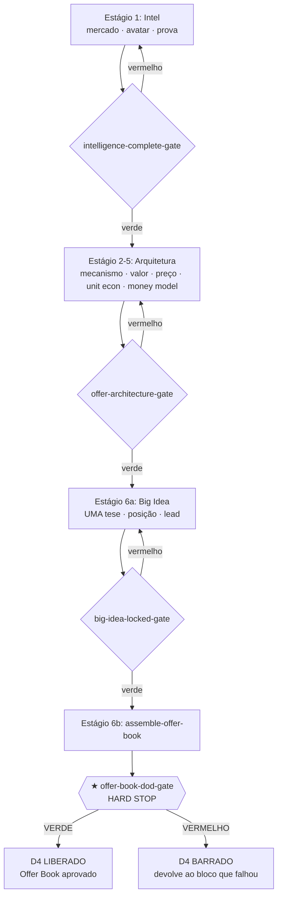

# Workflow — Construir o Offer Book (Intel → ★ HARD STOP)

## Objetivo
Levar um caso do briefing cru ao **Offer Book aprovado** — a fundação estratégica completa que toda copy, funil e operação consomem. O resultado ponta-a-ponta é um documento-mestre com os 10 blocos preenchidos e o **★ HARD STOP** ([`offer-book-stack/offer-book-dod-gate`](../checklists/offer-book-stack/offer-book-dod-gate.md)) **verde**. Este workflow é o coração do squad: cobre os estágios 1 a 6 (inteligência → arquitetura de oferta → Big Idea → montagem) e termina exatamente no portão que separa estratégia de execução. Espelha o composite `run-offer-book` do [`config.yaml`](../config.yaml). Antes deste gate verde, persuasão é maquiagem sobre oferta fraca; depois dele, o D4 abre.

## Gatilho
Inicia quando o [`offerbook-chief`](../agents/offerbook-chief.md) trava o project type e o escopo em uma frase via [`intake-and-scope`](../tasks/planning/intake-and-scope.md), e o [`offer-squad-architect`](../agents/offer-squad-architect.md) desenha o pipeline do caso em [`design-pipeline`](../tasks/planning/design-pipeline.md). Pré-condição: existe um briefing e, idealmente, um handoff de pesquisa do deepresearch squad (market sizing + VOC + competitor intel).

## Agentes
Ordenados pelo fluxo: [`offerbook-chief`](../agents/offerbook-chief.md) → [`offer-squad-architect`](../agents/offer-squad-architect.md) → [`market-sophistication-analyst`](../agents/market-sophistication-analyst.md) → [`avatar-voc-investigator`](../agents/avatar-voc-investigator.md) → [`proof-credibility-curator`](../agents/proof-credibility-curator.md) → [`mechanism-architect`](../agents/mechanism-architect.md) → [`value-equation-engineer`](../agents/value-equation-engineer.md) → [`pricing-wtp-strategist`](../agents/pricing-wtp-strategist.md) → [`unit-economics-stack-analyst`](../agents/unit-economics-stack-analyst.md) → [`money-model-designer`](../agents/money-model-designer.md) → [`big-idea-architect`](../agents/big-idea-architect.md) → [`positioning-lead-strategist`](../agents/positioning-lead-strategist.md) → [`compliance-auditor`](../agents/compliance-auditor.md). O chief e o compliance co-assinam o HARD STOP.

## Mapa de Estágios

| # | Estágio | Agente(s) | Task(s) | Gates | Outputs |
|---|---|---|---|---|---|
| 1 | Intel: mercado | [`market-sophistication-analyst`](../agents/market-sophistication-analyst.md) | [`run-market-intel`](../tasks/intelligence/run-market-intel.md) | `market/market-sophistication-gate`, `market/market-awareness-gate`, `market/market-starving-crowd-gate` | `artifact.market-brief` |
| 1 | Intel: avatar | [`avatar-voc-investigator`](../agents/avatar-voc-investigator.md) | [`build-avatar-voc`](../tasks/intelligence/build-avatar-voc.md) | `avatar/avatar-voc-verbatim-gate`, `avatar/avatar-dominant-emotion-gate`, `avatar/avatar-objection-map-gate` | `artifact.avatar-icp`, `artifact.voc-verbatim-bank` |
| 1 | Intel: prova | [`proof-credibility-curator`](../agents/proof-credibility-curator.md) | [`curate-proof`](../tasks/intelligence/curate-proof.md) | `proof/proof-claim-backing-gate` → [`intelligence-complete-gate`](../checklists/offer-book-stack/intelligence-complete-gate.md) | `artifact.proof-bank` |
| 2 | Mecanismo | [`mechanism-architect`](../agents/mechanism-architect.md) | [`define-mechanism`](../tasks/offer-architecture/define-mechanism.md) | `mechanism/mechanism-naming-gate`, `mechanism/mechanism-proof-gate`, `mechanism/mechanism-one-sentence-gate` | `artifact.mechanism-sheet` |
| 3 | Valor | [`value-equation-engineer`](../agents/value-equation-engineer.md) | [`score-value-equation`](../tasks/offer-architecture/score-value-equation.md) | `value/value-no-orphan-lever-gate` | `artifact.value-equation` |
| 4 | Preço + economia | [`pricing-wtp-strategist`](../agents/pricing-wtp-strategist.md), [`unit-economics-stack-analyst`](../agents/unit-economics-stack-analyst.md) | [`set-pricing-wtp`](../tasks/offer-architecture/set-pricing-wtp.md), [`model-unit-economics`](../tasks/offer-architecture/model-unit-economics.md) | [`pricing/pricing-value-derived-gate`](../checklists/pricing/pricing-value-derived-gate.md), `unit-economics-checklist` | `artifact.pricing-wtp-sheet`, `artifact.unit-economics-sheet`, `artifact.offer-stack`, `artifact.guarantee` |
| 5 | Money model | [`money-model-designer`](../agents/money-model-designer.md) | [`design-money-model`](../tasks/offer-architecture/design-money-model.md) | [`money-model/money-model-four-parts-gate`](../checklists/money-model/money-model-four-parts-gate.md), [`money-model/money-model-sequence-gate`](../checklists/money-model/money-model-sequence-gate.md), [`money-model/money-model-cta-per-step-gate`](../checklists/money-model/money-model-cta-per-step-gate.md) → [`offer-architecture-gate`](../checklists/offer-book-stack/offer-architecture-gate.md) | `artifact.money-model` |
| 6a | Big Idea | [`big-idea-architect`](../agents/big-idea-architect.md) | [`generate-big-ideas`](../tasks/big-idea/generate-big-ideas.md) | `big-idea/big-idea-single-gate`, `big-idea/big-idea-new-big-credible-gate`, `big-idea/big-idea-awareness-fit-gate` | `artifact.big-idea` |
| 6a | Posição + lead | [`positioning-lead-strategist`](../agents/positioning-lead-strategist.md) | [`lock-positioning-lead`](../tasks/big-idea/lock-positioning-lead.md) | `positioning/positioning-awareness-fit` → [`big-idea-locked-gate`](../checklists/offer-book-stack/big-idea-locked-gate.md) | `artifact.positioning`, `decision.lead-type-locked` |
| 6b | ★ Montagem + HARD STOP | [`offerbook-chief`](../agents/offerbook-chief.md), [`compliance-auditor`](../agents/compliance-auditor.md) | [`assemble-offer-book`](../tasks/assembly/assemble-offer-book.md) | [`offer-book-stack/offer-book-dod-gate`](../checklists/offer-book-stack/offer-book-dod-gate.md) **★ HARD STOP**, `chief/chief-offer-book-readiness-gate` | `artifact.offer-book`, `decision.hard-stop-status` |

## Diagrama

## Pontos de Decisão
- **Sofisticação do mercado (níveis 1–5):** define quanto a Big Idea precisa de mecanismo novo. Mercado virgem (1–2) vende o benefício direto; saturado (4–5) exige mecanismo único e nova identificação. O estágio 1 trava esse diagnóstico via [`awareness-x-sophistication`](../frameworks/awareness-x-sophistication.md) e ele ramifica o estágio 6a.
- **Consciência (Schwartz):** decide o lead em [`lock-positioning-lead`](../tasks/big-idea/lock-positioning-lead.md). Inconsciente → lead de história/problema; mais consciente → lead de oferta/prova. O lead travado é contrato para todo o D4.
- **Money model com <4 partes:** aceitável ≥2 (`config.yaml: money_model_min_parts: 2`), mas o chief decide se o caso justifica a escada completa ou um único promo (ver [`single-promo`](single-promo.md)).
- **Claim grande órfão de prova:** ramifica de volta ao [`proof-credibility-curator`](../agents/proof-credibility-curator.md) antes da montagem.

## Critério de Saída
O workflow completa quando **todos os gates estão verdes**: os três gates agregadores de D1–D3 ([`intelligence-complete-gate`](../checklists/offer-book-stack/intelligence-complete-gate.md), [`offer-architecture-gate`](../checklists/offer-book-stack/offer-architecture-gate.md), [`big-idea-locked-gate`](../checklists/offer-book-stack/big-idea-locked-gate.md)) e o **★ HARD STOP** ([`offer-book-dod-gate`](../checklists/offer-book-stack/offer-book-dod-gate.md)). Estado terminal: `decision.hard-stop-status = VERDE`, os 10 blocos do Offer Book sem `{{PLACEHOLDER}}`, nenhum claim órfão, escassez 100% verdadeira, e `chief/chief-offer-book-readiness-gate` verde. Só então o caso cruza para a copy de D4 (ver [`full-launch-blackbook`](full-launch-blackbook.md) ou [`single-promo`](single-promo.md)). Não existe estado "parcial liberado".

## Falha/Rollback
Cada gate vermelho tem um ponto de re-entrada nomeado, nunca avança:
- **Intel incompleta** → volta ao estágio 1 (mercado, avatar ou prova) com o defeito nomeado.
- **Arquitetura reprovada** → o [`value-equation-engineer`](../agents/value-equation-engineer.md) ou [`money-model-designer`](../agents/money-model-designer.md) (ambos com veto) devolvem ao dono do componente órfão.
- **Big Idea múltipla** → o [`big-idea-architect`](../agents/big-idea-architect.md) (veto) recusa e reduz a UMA tese.
- **HARD STOP vermelho** → o [`assemble-offer-book`](../tasks/assembly/assemble-offer-book.md) nomeia o bloco que falhou e devolve ao agente dono (claim → proof-curator; escassez falsa → unit-econ; duas teses → big-idea). Qualquer mudança em money model, preço ou Big Idea **reabre** o HARD STOP e invalida copy já iniciada. Override só com `decision_id` humano explícito no [`decision-registry`](../data/registries/decision-registry.md) — nunca por pressa de prazo.
