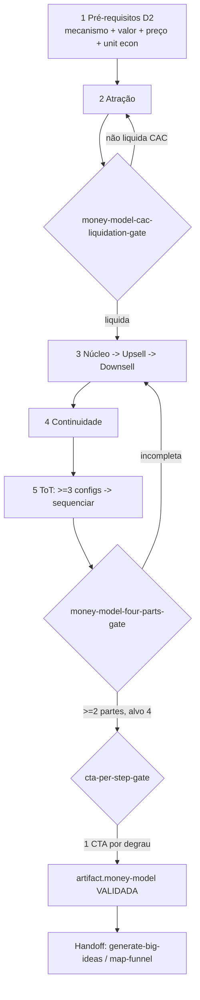

# Workflow — Desenhar o Money Model (só a escada)

## Objetivo
Produzir **a espinha econômica isolada** — o Money Model travado e validado, sem avançar para Big Idea, copy ou funil. O resultado ponta-a-ponta é uma escada de 2 a 4+ degraus (atração → núcleo → upsell → downsell → continuidade), cada degrau com papel, tipo de oferta, preço por valor, **um** CTA e alavanca de valor declarada, em que a **atração liquida o CAC** em menos de 30 dias. Este workflow é o slice de D2 do pipeline maior: é o que se roda quando o cliente já tem oferta e prova, mas precisa transformar uma oferta avulsa em uma **sequência** que financia a aquisição (`money_model_spine`). Espelha a task [`design-money-model`](../tasks/offer-architecture/design-money-model.md) e seus pré-requisitos de D2. É o coração do princípio "o centro é a sequência, não a oferta".

## Gatilho
Inicia quando o [`offerbook-chief`](../agents/offerbook-chief.md) classifica o caso como **offer-ladder** em [`intake-and-scope`](../tasks/planning/intake-and-scope.md) — pedido focado em "monetizar melhor o que já existe" (subir AOV, fechar a continuidade, recuperar margem do "não"). Também ativa **dentro** do [`offer-book-build`](offer-book-build.md) como o estágio 5. Pré-condição inegociável (do gatilho da própria task): mecanismo provado, scorecard de valor e unit economics preliminares disponíveis. Sem unit economics, o [`money-model-designer`](../agents/money-model-designer.md) desenha apenas a **forma** marcada `não-validada` e bloqueia o avanço — pois sem saber o CAC, nenhuma escada prova que se sustenta.

## Agentes
Ordenados pelo fluxo, é o time de D2 sob o dono da espinha:
1. [`offerbook-chief`](../agents/offerbook-chief.md) — classifica e prioriza o caso (D0).
2. [`mechanism-architect`](../agents/mechanism-architect.md) — entrega o mecanismo que o núcleo da escada orbita (pré-requisito).
3. [`value-equation-engineer`](../agents/value-equation-engineer.md) — diz **o que** pertence a cada degrau (qual componente move qual alavanca); **tem veto**.
4. [`pricing-wtp-strategist`](../agents/pricing-wtp-strategist.md) — fixa o **preço** de cada degrau por valor/WTP.
5. [`unit-economics-stack-analyst`](../agents/unit-economics-stack-analyst.md) — valida a **liquidação do CAC** no front-end.
6. [`money-model-designer`](../agents/money-model-designer.md) — **dono da espinha**, sequencia a escada; detém o veto mais estrutural do squad (sem escada, nada a jusante começa).

## Mapa de Estágios

| # | Estágio | Agente(s) | Task(s) | Gates | Outputs |
|---|---|---|---|---|---|
| 0 | Intake & escopo | [`offerbook-chief`](../agents/offerbook-chief.md) | [`intake-and-scope`](../tasks/planning/intake-and-scope.md) | `chief/chief-scope-approval-gate` | `decision.project-type = offer-ladder` |
| 1 | Pré-requisitos de D2 | [`mechanism-architect`](../agents/mechanism-architect.md), [`value-equation-engineer`](../agents/value-equation-engineer.md), [`pricing-wtp-strategist`](../agents/pricing-wtp-strategist.md), [`unit-economics-stack-analyst`](../agents/unit-economics-stack-analyst.md) | [`define-mechanism`](../tasks/offer-architecture/define-mechanism.md), [`score-value-equation`](../tasks/offer-architecture/score-value-equation.md), [`set-pricing-wtp`](../tasks/offer-architecture/set-pricing-wtp.md), [`model-unit-economics`](../tasks/offer-architecture/model-unit-economics.md) | `value/value-no-orphan-lever-gate`, [`pricing/pricing-value-derived-gate`](../checklists/pricing/pricing-value-derived-gate.md), `unit-economics-checklist` | `artifact.mechanism-sheet`, `artifact.value-equation-scorecard`, `artifact.pricing-wtp-sheet`, `artifact.unit-economics-sheet` |
| 2 | Atração (liquida CAC) | [`money-model-designer`](../agents/money-model-designer.md) | [`design-money-model`](../tasks/offer-architecture/design-money-model.md) (passo atração) | [`money-model/money-model-cac-liquidation-gate`](../checklists/money-model/money-model-cac-liquidation-gate.md) | degrau de atração + ponto de liquidação |
| 3 | Núcleo + upsell + downsell | [`money-model-designer`](../agents/money-model-designer.md), [`value-equation-engineer`](../agents/value-equation-engineer.md) | [`design-money-model`](../tasks/offer-architecture/design-money-model.md) (passos núcleo/upsell/downsell) | [`money-model/money-model-four-parts-gate`](../checklists/money-model/money-model-four-parts-gate.md) | núcleo, upsell de aceleração, downsell de recuperação |
| 4 | Continuidade (LTV) | [`money-model-designer`](../agents/money-model-designer.md) | [`design-money-model`](../tasks/offer-architecture/design-money-model.md) (passo continuidade) | `money-model/money-model-propagation-gate` | degrau de recorrência com valor contínuo real |
| 5 | Sequenciar + CTA por degrau | [`money-model-designer`](../agents/money-model-designer.md) | [`design-money-model`](../tasks/offer-architecture/design-money-model.md) (ToT: ≥3 configs) | [`money-model/money-model-sequence-gate`](../checklists/money-model/money-model-sequence-gate.md), [`money-model/money-model-cta-per-step-gate`](../checklists/money-model/money-model-cta-per-step-gate.md) | `artifact.money-model`, `artifact.products-and-offers`, `decision.ladder-configuration` |

## Diagrama

## Pontos de Decisão
- **Tipo de oferta de atração:** o [`money-model-designer`](../agents/money-model-designer.md) testa tripwire vs free+frete vs challenge vs win-your-money-back via [`attraction-offer-design`](../frameworks/money-model-designer/attraction-offer-design.md). O critério eliminatório é **cobrir o CAC** — toda configuração que não liquida é podada de saída.
- **Profundidade da escada:** mínimo aceitável 2 partes (`config.yaml: money_model_min_parts: 2`), alvo 4. Caso de margem apertada pode parar em atração+núcleo; caso de LTV alto justifica continuidade robusta.
- **Continuidade real vs cobrança vazia:** via [`continuity-design`](../frameworks/money-model-designer/continuity-design.md), a recorrência precisa de **valor contínuo real**; senão o LTV infla no papel e o `compliance-auditor` rejeita continuidade obrigatória sem cancelamento claro.
- **Upsell no pico:** o [`upsell-downsell-logic`](../frameworks/money-model-designer/upsell-downsell-logic.md) coloca o acelerador (Tempo↓ do value scorecard) no pico de compra; o "não" cai no downsell que recupera margem.

## Critério de Saída
O workflow completa quando **todos os gates de money model estão verdes**: [`money-model/money-model-four-parts-gate`](../checklists/money-model/money-model-four-parts-gate.md) (≥2 partes, alvo 4), [`money-model/money-model-sequence-gate`](../checklists/money-model/money-model-sequence-gate.md) (ordem coerente), [`money-model/money-model-cta-per-step-gate`](../checklists/money-model/money-model-cta-per-step-gate.md) (um CTA por degrau) e [`money-model/money-model-cac-liquidation-gate`](../checklists/money-model/money-model-cac-liquidation-gate.md) (a atração liquida o CAC, validada pelo [`unit-economics-stack-analyst`](../agents/unit-economics-stack-analyst.md)). Estado terminal: `decision.ladder-configuration` travada, ≥3 configurações comparadas e a vencedora defensável, a espinha logada no [`offer-registry`](../data/registries/offer-registry.md) e os pontos de preço no [`price-test-registry`](../data/registries/price-test-registry.md), com `status: validada`. Se a espinha não fecha, fica `não-validada` e qualquer copy a jusante permanece **barrada**.

## Falha/Rollback
- **Atração não cobre o CAC** → itera a forma (mover upsell para mais cedo, trocar o tipo de atração); reentra no estágio 2. Máximo de 3 ciclos antes de escalar ao chief.
- **Componente órfão de alavanca** → o [`value-equation-engineer`](../agents/value-equation-engineer.md) (veto) devolve ao desenho do degrau.
- **Unit economics ausente** → a escada fica `não-validada`; reentra no estágio 1 ([`model-unit-economics`](../tasks/offer-architecture/model-unit-economics.md)) antes de validar.
- **Continuidade sem valor real** → o [`money-model-designer`](../agents/money-model-designer.md) redesenha o degrau de recorrência antes do gate de propagação.
- **Handoff a jusante:** com a escada validada, a próxima parada é [`generate-big-ideas`](../tasks/big-idea/generate-big-ideas.md) (no [`offer-book-build`](offer-book-build.md)) e, depois do HARD STOP, [`map-funnel`](../tasks/funnel-tech/map-funnel.md) — o funil **espelha** a escada. Garantia: nenhum downstream recebe uma oferta avulsa, só uma sequência completa com CTA por degrau e atração validada como liquidante do CAC.
