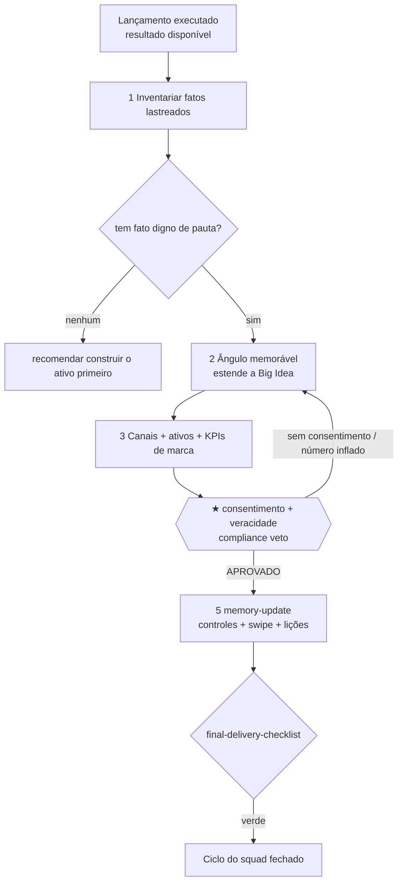

# Workflow — PR Pós-Lançamento & Memorialização da Marca (do resultado ao capital de marca e à memória reutilizável)

## Objetivo
Transformar o resultado do lançamento em **capital de marca duradouro e em memória reutilizável**. O resultado ponta-a-ponta tem duas faces: (1) o **plano de PR** com um ângulo memorável lastreado em fato verificável, mapa de canais, ativos e KPIs de marca ([`build-pr-plan`](../tasks/growth/build-pr-plan.md)); e (2) o fechamento do ciclo do squad — controles vencedores, swipe e lições aprendidas gravados nos registries ([`memory-update`](../tasks/qa-memory/memory-update.md)), para que o próximo lançamento reuse antes de recriar (`memory_before_repetition`). Este workflow é o flanco pós-venda do [`full-launch-blackbook`](full-launch-blackbook.md): roda quando o lançamento foi executado e há resultado para virar narrativa. O princípio: nenhum PR sobre conquista inventada — cada ângulo nasce de um fato consentido e estende a Big Idea travada, nunca cria tese paralela.

## Gatilho
Inicia quando o lançamento foi executado (ou está na janela final) e há resultado/prova suficiente para virar narrativa — o [`pr-brand-strategist`](../agents/pr-brand-strategist.md) recebe os marcos do [`run-of-show`](../tasks/ops/build-run-of-show.md) e do [`events-calendar`](../tasks/ops/build-events-logistics.md), e os parceiros de topo do [`affiliate-program`](../tasks/growth/build-affiliate-program.md). Pré-condição inegociável (do gatilho da task): **sem um fato lastreado não cria ângulo** — PR sobre conquista inventada destrói a marca e cai no veto de compliance. Sem fato algum digno de pauta → dizer isso e recomendar construir o ativo (caso, dado) primeiro. A memorialização (estágio final) só roda sobre o [`launch-blackbook`](../tasks/qa-memory/assemble-blackbook.md) fechado e com compliance APROVADO.

## Agentes
Ordenados pelo fluxo:
1. [`pr-brand-strategist`](../agents/pr-brand-strategist.md) — o guardião do halo; isola o ângulo, planeja o alcance e define a medição.
2. [`affiliate-program-architect`](../agents/affiliate-program-architect.md) — (upstream) entrega os parceiros Dream 100 como multiplicadores de PR (co-marketing, endossos).
3. [`compliance-auditor`](../agents/compliance-auditor.md) — audita o consentimento e a veracidade de cada ativo de PR (**★ VETO**: caso sem consentimento, número inflado).
4. [`knowledge-librarian`](../agents/knowledge-librarian.md) — extrai e grava controles, swipe e lições aprendidas; fecha o ciclo.

## Mapa de Estágios

| # | Estágio | Agente(s) | Task(s) | Gates | Outputs |
|---|---|---|---|---|---|
| 1 | Inventariar fatos lastreados | [`pr-brand-strategist`](../agents/pr-brand-strategist.md) | [`build-pr-plan`](../tasks/growth/build-pr-plan.md) (passo inventário) | — | lista de fatos com prova/consentimento |
| 2 | Ângulo memorável (ToT) | [`pr-brand-strategist`](../agents/pr-brand-strategist.md) | [`build-pr-plan`](../tasks/growth/build-pr-plan.md) (ToT ângulo) | [`pr-plan-checklist`](../checklists/pr/pr-plan-checklist.md) | `decision.brand-angle` (estende a Big Idea) |
| 3 | Canais + ativos + KPIs de marca | [`pr-brand-strategist`](../agents/pr-brand-strategist.md), [`affiliate-program-architect`](../agents/affiliate-program-architect.md) | [`build-pr-plan`](../tasks/growth/build-pr-plan.md) (canais/KPIs) | [`pr-plan-checklist`](../checklists/pr/pr-plan-checklist.md) | `artifact.pr-plan` (canais, cadência, KPIs de halo) |
| 4 | ★ Compliance: consentimento + veracidade | [`compliance-auditor`](../agents/compliance-auditor.md) | [`compliance-audit`](../tasks/qa-memory/compliance-audit.md) (escopo PR) | [`compliance/compliance-claim-backing-gate`](../checklists/compliance/compliance-claim-backing-gate.md), [`compliance/compliance-data-privacy-gate`](../checklists/compliance/compliance-data-privacy-gate.md) **★ VETO** | `decision.compliance-verdict` |
| 5 | Memorialização (fecha o ciclo) | [`knowledge-librarian`](../agents/knowledge-librarian.md) | [`memory-update`](../tasks/qa-memory/memory-update.md) | [`final-delivery-checklist`](../checklists/cross-squad/final-delivery-checklist.md) | `registry.lessons-learned-update`, `registry.swipe-update`, `registry.control-update` |

## Diagrama

## Pontos de Decisão
- **Fonte do ângulo (estágio 2):** ≥3 ângulos de fontes de prova diferentes — resultado coletivo, história/herói (com consentimento), tese/contrarian — via [`launch/pr-brand-maximization`](../frameworks/launch/pr-brand-maximization.md). A **veracidade/lastro é critério eliminatório**: ângulo de lastro baixo é descartado imediatamente; entre os lastreados, vence a maior memorabilidade.
- **Fit com a Big Idea:** o ângulo escolhido **estende** a tese travada pelo [`big-idea-architect`](../agents/big-idea-architect.md); ângulo que cria tese paralela é realinhado (a marca fala uma voz só).
- **Foco de canal (estágio 3):** ≥3 focos — mídia ganha, autoridade do fundador, prova social interna — pontuados por alcance novo, custo, durabilidade do ativo e contribuição para a próxima conversão. Os parceiros Dream 100 entram como canal de co-marketing.
- **O que vira memória (estágio 5):** o [`knowledge-librarian`](../agents/knowledge-librarian.md) decide quais controles viram baseline, quais ganchos/sequências viram swipe (em redação original) e quais decisões viram lição — sempre rastreável à fonte e sem duplicar padrão equivalente.

## Critério de Saída
O workflow completa quando **todos os gates estão verdes**: o [`pr-plan-checklist`](../checklists/pr/pr-plan-checklist.md) (ângulo verificável e consentido, estende a Big Idea, KPIs de marca mensuráveis), o **★ VETO** de compliance ([`compliance/compliance-claim-backing-gate`](../checklists/compliance/compliance-claim-backing-gate.md) + [`compliance/compliance-data-privacy-gate`](../checklists/compliance/compliance-data-privacy-gate.md)) com `decision.compliance-verdict = APROVADO`, e o [`final-delivery-checklist`](../checklists/cross-squad/final-delivery-checklist.md) (os três registries de memória atualizados, rastreáveis e sem duplicata). Estado terminal: o plano de PR pronto para executar com cada ângulo lastreado em fato consentido; e o ciclo do squad fechado — `control-registry`, `swipe-registry` e `lessons-learned-registry` alimentam o **próximo** lançamento (a [`intake-and-scope`](../tasks/planning/intake-and-scope.md) consulta as lições antes de repetir). É o fim do pipeline.

## Falha/Rollback
- **Nenhum fato digno de pauta** → o [`pr-brand-strategist`](../agents/pr-brand-strategist.md) **para** e recomenda construir o ativo (caso, dado) primeiro; não inventa narrativa.
- **Ângulo que cria tese paralela** → realinhar à Big Idea travada; reentra no estágio 2.
- **★ VETO de compliance** → caso sem consentimento, número inflado, endosso sem permissão ou claim de resultado sem lastro → volta ao [`pr-brand-strategist`](../agents/pr-brand-strategist.md) para reancorar em fato consentido. O veto é absoluto.
- **Memória parcial ou não-conforme** → o [`knowledge-librarian`](../agents/knowledge-librarian.md) **não registra** memória de material não fechado ou com claim sem lastro; aguarda o blackbook aprovado. Aplica [`proof-to-claim-chain`](../frameworks/proof-to-claim-chain.md): nenhum swipe carrega claim sem prova.
- **Re-entrada:** um novo fato lastreado (caso, marco) reabre o ângulo e os ativos. Override de qualquer veto só com `decision_id` humano explícito do [`offerbook-chief`](../agents/offerbook-chief.md) no [`decision-registry`](../data/registries/decision-registry.md).
