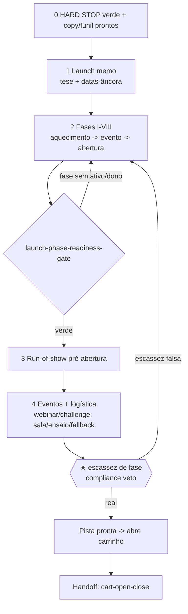

# Workflow — Pré-Lançamento (a pista que constrói desejo antes de pedir o dinheiro)

## Objetivo
Transformar a estratégia aprovada na **pista de pré-lançamento datada** — o cronograma de ~45 dias que aquece a audiência, entrega valor, derruba objeções e constrói desejo **antes** de abrir o carrinho. O resultado ponta-a-ponta: o launch memo (tese, datas-âncora, meta), as **Fases I–VIII** ([`runway-and-phases`](../frameworks/launch/runway-and-phases.md)), o run-of-show da pré-abertura e o calendário de eventos (webinar/challenge/lives) com logística e fallbacks. Este workflow é o slice de pré-lançamento do [`full-launch-blackbook`](full-launch-blackbook.md): roda **depois** do **★ HARD STOP** verde e da copy/funil entregues, e entrega o caso pronto para a janela de venda (que o [`cart-open-close`](cart-open-close.md) detalha). O princípio: a venda do núcleo vem **depois** da prova; a pista respeita a espinha do money model.

## Gatilho
Inicia quando o [`launch-producer`](../agents/launch-producer.md) recebe o sinal de que o Offer Book passou no [`offer-book-stack/offer-book-dod-gate`](../checklists/offer-book-stack/offer-book-dod-gate.md) **e** a camada D4 (copy) e D5 (funil/tech) entregaram seus artefatos. Pré-condição inegociável (do gatilho de [`build-launch-memo`](../tasks/ops/build-launch-memo.md)): **sem money model não sequencia** — sem a espinha, a pista seria uma agenda de eventos avulsos. Copy ou funil não prontos → não montar as fases; devolver ao [`offerbook-chief`](../agents/offerbook-chief.md) com o que falta.

## Agentes
Ordenados pelo fluxo:
1. [`launch-producer`](../agents/launch-producer.md) — o diretor de palco; escreve o memo, fasea a pista e coreografa o run-of-show.
2. [`events-logistics-coordinator`](../agents/events-logistics-coordinator.md) — operacionaliza cada evento da pista (salas, links, ensaios, fallbacks) e o inventário.
3. [`email-sms-sequence-writer`](../agents/email-sms-sequence-writer.md) — (upstream, já entregue) fornece as sequências de pré-lançamento que a pista encaixa.
4. [`tech-links-deliverability-engineer`](../agents/tech-links-deliverability-engineer.md) — (upstream) confirma capacidade e janelas de envio que limitam a pista.
5. [`compliance-auditor`](../agents/compliance-auditor.md) — audita a escassez planejada de cada fase (veto se falsa).

## Mapa de Estágios

| # | Estágio | Agente(s) | Task(s) | Gates | Outputs |
|---|---|---|---|---|---|
| 0 | Pré-condição | — | (herda do [`full-launch-blackbook`](full-launch-blackbook.md)) | [`offer-book-stack/offer-book-dod-gate`](../checklists/offer-book-stack/offer-book-dod-gate.md) verde + copy/funil entregues | `artifact.offer-book`, `artifact.vsl-script`, `artifact.funnel-map` |
| 1 | Launch memo & arquitetura | [`launch-producer`](../agents/launch-producer.md) | [`build-launch-memo`](../tasks/ops/build-launch-memo.md) | — | `artifact.launch-memo` (tese, datas-âncora, meta, papéis) |
| 2 | Pista de Fases I–VIII | [`launch-producer`](../agents/launch-producer.md) | [`build-launch-memo`](../tasks/ops/build-launch-memo.md) (passo de fases) | [`launch/launch-phase-readiness-gate`](../checklists/launch/launch-phase-readiness-gate.md) | `artifact.launch-phases` (cada fase com data, dono, ativo) |
| 3 | Run-of-show da pré-abertura | [`launch-producer`](../agents/launch-producer.md) | [`build-run-of-show`](../tasks/ops/build-run-of-show.md) | [`launch/launch-surge-gate`](../checklists/launch/launch-surge-gate.md) | `artifact.run-of-show` (até o carrinho abrir) |
| 4 | Eventos & logística | [`events-logistics-coordinator`](../agents/events-logistics-coordinator.md) | [`build-events-logistics`](../tasks/ops/build-events-logistics.md) | [`events-logistics-checklist`](../checklists/events/events-logistics-checklist.md) | `artifact.events-calendar` (webinar/challenge com sala, ensaio, fallback) |
| 5 | Auditoria de escassez planejada | [`compliance-auditor`](../agents/compliance-auditor.md) | [`compliance-audit`](../tasks/qa-memory/compliance-audit.md) (escopo escassez de fase) | `compliance/compliance-scarcity-truth-gate` **★ VETO** | escassez de cada fase confirmada real |

## Diagrama

## Pontos de Decisão
- **Formato de evento (estágio 1):** o [`launch-producer`](../agents/launch-producer.md) gera ≥3 arquiteturas — PLF clássico, [`perfect-webinar`](../frameworks/launch/perfect-webinar.md), challenge — e pontua por fit de preço/complexidade, aderência do avatar, carga operacional e construção de desejo. Oferta complexa/cara pede webinar ou challenge; oferta simples pode usar PLF de vídeos.
- **Duração da pista:** ~45 dias é o default; ramifica por temperatura da lista (lista fria precisa de runway mais longo de aquecimento; lista quente comprime). A consciência (Schwartz) do estágio de intel calibra quanto aquecimento é preciso.
- **Ordem das fases pela espinha:** via [`money-model-sequence`](../frameworks/money-model-sequence.md), a atração precede o núcleo; a venda do núcleo vem **depois** da prova (Fases V–VII). Fase fora de ordem que pede o dinheiro cedo demais é reordenada.
- **Escassez de fase (estágio 5):** cada deadline/vaga de fase **tem de ser real**; o [`events-logistics-coordinator`](../agents/events-logistics-coordinator.md) ancora o limite no inventory tracker e o [`compliance-auditor`](../agents/compliance-auditor.md) veta o que não bate.

## Critério de Saída
O workflow completa quando **todos os gates estão verdes**: [`launch/launch-phase-readiness-gate`](../checklists/launch/launch-phase-readiness-gate.md) (cada Fase I–VIII com data, dono e ativo pronto), [`launch/launch-surge-gate`](../checklists/launch/launch-surge-gate.md) (capacidade de pico confirmada para os eventos), [`events-logistics-checklist`](../checklists/events/events-logistics-checklist.md) (cada evento com sala/link/ensaio/fallback) e o gate de escassez de compliance (cada limite de fase real). Estado terminal: a pista é uma linha do tempo datada, sem buraco, com cada fase na ordem que constrói desejo, e o caso está pronto para a **abertura de carrinho** ([`cart-open-close`](cart-open-close.md)). Nenhuma fase carrega escassez falsa.

## Falha/Rollback
- **Fase sem ativo pronto** → marca `bloqueado por <input>` e aciona o autor da copy/evento; a pista não fecha com lacuna.
- **Capacidade de pico não confirmada** → escala ao [`tech-links-deliverability-engineer`](../agents/tech-links-deliverability-engineer.md) **antes** de cravar a data do evento (via [`surge-ops`](../frameworks/launch/surge-ops.md)).
- **Evento sem sala/ensaio/fallback** → o [`events-logistics-coordinator`](../agents/events-logistics-coordinator.md) não declara pronto; reentra no estágio 4.
- **★ Escassez de fase falsa** → o [`compliance-auditor`](../agents/compliance-auditor.md) veta e devolve ao [`launch-producer`](../agents/launch-producer.md) para reancorar no inventário real.
- **Handoff:** com a pista pronta, o caso entra em [`cart-open-close`](cart-open-close.md) (a janela de venda minuto a minuto) e, no flanco pós-venda, em [`post-launch-pr`](post-launch-pr.md). Re-entrada: qualquer mudança de data-âncora reabre o run-of-show e o calendário de eventos.
