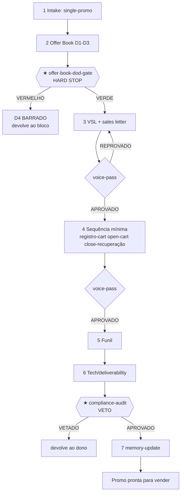

# Workflow — Promo Única (caminho enxuto até a venda)

## Objetivo
Levar uma oferta do briefing à **promoção única pronta para vender** — o caminho mais curto que ainda respeita o HARD STOP. O resultado ponta-a-ponta é um pacote enxuto: Offer Book aprovado, **VSL/sales letter**, a **sequência mínima** de e-mail/SMS (registro → carrinho aberto → carrinho fechado → recuperação), o **funil** que liga tudo, e o veredito de compliance APROVADO. Espelha o composite `run-single-promo` do [`config.yaml`](../config.yaml). É a escolha quando a oferta ainda não merece um lançamento completo (sem evento de venda, sem exército de afiliados, sem PR) mas precisa converter já. A disciplina é idêntica à do full-launch: nenhuma palavra de copy antes do **★ HARD STOP** ([`offer-book-stack/offer-book-dod-gate`](../checklists/offer-book-stack/offer-book-dod-gate.md)) verde.

## Gatilho
Inicia quando o [`offerbook-chief`](../agents/offerbook-chief.md) classifica o project type como **single-promo** em [`intake-and-scope`](../tasks/planning/intake-and-scope.md). Rubrica de escolha (da própria task de intake): oferta não validada + prazo curto, ou orçamento que não paga produção de evento/afiliados/PR. Pré-condição: existe um briefing. O [`offer-squad-architect`](../agents/offer-squad-architect.md) desenha um pipeline mais curto em [`design-pipeline`](../tasks/planning/design-pipeline.md) — mantém os estágios de estratégia (D1–D3) e poda ops/eventos/afiliados/PR/blackbook.

## Agentes
Ordenados pelo fluxo: [`offerbook-chief`](../agents/offerbook-chief.md) → [`offer-squad-architect`](../agents/offer-squad-architect.md) → o time de estratégia D1–D3 (idêntico ao [`offer-book-build`](offer-book-build.md): [`market-sophistication-analyst`](../agents/market-sophistication-analyst.md), [`avatar-voc-investigator`](../agents/avatar-voc-investigator.md), [`proof-credibility-curator`](../agents/proof-credibility-curator.md), [`mechanism-architect`](../agents/mechanism-architect.md), [`value-equation-engineer`](../agents/value-equation-engineer.md), [`pricing-wtp-strategist`](../agents/pricing-wtp-strategist.md), [`unit-economics-stack-analyst`](../agents/unit-economics-stack-analyst.md), [`money-model-designer`](../agents/money-model-designer.md), [`big-idea-architect`](../agents/big-idea-architect.md), [`positioning-lead-strategist`](../agents/positioning-lead-strategist.md)) → **★ HARD STOP** → [`vsl-webinar-scriptwriter`](../agents/vsl-webinar-scriptwriter.md) → [`email-sms-sequence-writer`](../agents/email-sms-sequence-writer.md) → [`voice-style-guardian`](../agents/voice-style-guardian.md) (veto de voz) → [`funnel-architect`](../agents/funnel-architect.md) → [`tech-links-deliverability-engineer`](../agents/tech-links-deliverability-engineer.md) → [`compliance-auditor`](../agents/compliance-auditor.md) (veto) → [`knowledge-librarian`](../agents/knowledge-librarian.md).

## Mapa de Estágios

| # | Estágio | Agente(s) | Task(s) | Gates | Outputs |
|---|---|---|---|---|---|
| 1 | Intake & pipeline | [`offerbook-chief`](../agents/offerbook-chief.md), [`offer-squad-architect`](../agents/offer-squad-architect.md) | [`intake-and-scope`](../tasks/planning/intake-and-scope.md), [`design-pipeline`](../tasks/planning/design-pipeline.md) | `chief/chief-project-type-gate`, `chief/chief-scope-approval-gate` | `decision.project-type = single-promo` |
| 2 | ★ Offer Book completo (D1–D3) | time de estratégia | sub-workflow [`offer-book-build`](offer-book-build.md) (intel → arquitetura → Big Idea → montagem) | [`offer-book-stack/offer-book-dod-gate`](../checklists/offer-book-stack/offer-book-dod-gate.md) **★ HARD STOP** | `artifact.offer-book`, `decision.hard-stop-status` |
| 3 | VSL & sales letter | [`vsl-webinar-scriptwriter`](../agents/vsl-webinar-scriptwriter.md), [`voice-style-guardian`](../agents/voice-style-guardian.md) | [`write-vsl-webinar`](../tasks/copy/write-vsl-webinar.md) → [`voice-pass`](../tasks/copy/voice-pass.md) | [`vsl/vsl-value-before-price-gate`](../checklists/vsl/vsl-value-before-price-gate.md), `vsl/vsl-cta-strength-gate`, `voice/voice-checklist` | `artifact.vsl-script`, `artifact.sales-letter`, `decision.voice-verdict` |
| 4 | Sequência mínima de e-mail/SMS | [`email-sms-sequence-writer`](../agents/email-sms-sequence-writer.md), [`voice-style-guardian`](../agents/voice-style-guardian.md) | [`write-email-sms-sequences`](../tasks/copy/write-email-sms-sequences.md) → [`voice-pass`](../tasks/copy/voice-pass.md) | [`email-sms/email-step-coverage-gate`](../checklists/email-sms/email-step-coverage-gate.md), `email-sms/email-timing-gate` | `artifact.email-sms-sequences`, `artifact.sequence-matrix` |
| 5 | Funil | [`funnel-architect`](../agents/funnel-architect.md) | [`map-funnel`](../tasks/funnel-tech/map-funnel.md) | [`funnel/funnel-no-dead-end-gate`](../checklists/funnel/funnel-no-dead-end-gate.md), `funnel/funnel-backend-gate` | `artifact.funnel-map`, `artifact.page-specs` |
| 6 | Tech & deliverability | [`tech-links-deliverability-engineer`](../agents/tech-links-deliverability-engineer.md) | [`plan-tech-deliverability`](../tasks/funnel-tech/plan-tech-deliverability.md) | `tech-deliverability-checklist`, [`launch/launch-fallback-gate`](../checklists/launch/launch-fallback-gate.md) | `artifact.tech-deliverability-plan`, `artifact.links-urls` |
| 7 | ★ Compliance (VETO) | [`compliance-auditor`](../agents/compliance-auditor.md), [`offerbook-chief`](../agents/offerbook-chief.md) | [`compliance-audit`](../tasks/qa-memory/compliance-audit.md) | [`compliance/compliance-claim-backing-gate`](../checklists/compliance/compliance-claim-backing-gate.md), [`compliance/compliance-scarcity-truth-gate`](../checklists/compliance/compliance-scarcity-truth-gate.md) **★ VETO** | `decision.compliance-verdict` |
| 8 | Memória | [`knowledge-librarian`](../agents/knowledge-librarian.md) | [`memory-update`](../tasks/qa-memory/memory-update.md) | `final-delivery-checklist` | `registry.control-update`, `registry.swipe-update` |

## Diagrama

## Pontos de Decisão
- **Consciência → lead da VSL:** o lead travado em [`lock-positioning-lead`](../tasks/big-idea/lock-positioning-lead.md) define a abertura do Bloco 1 da VSL. Frio/inconsciente abre por história/problema; quente/consciente abre por oferta/prova.
- **Money model com <4 partes:** na promo única, aceita-se o mínimo (`config.yaml: money_model_min_parts: 2` — atração + núcleo). Se o chief decidir que o caso merece a escada completa, o promo escala para [`full-launch-blackbook`](full-launch-blackbook.md).
- **Cadência da sequência mínima (estágio 4):** o [`email-sms-sequence-writer`](../agents/email-sms-sequence-writer.md) calibra suave/padrão/agressiva via [`launch/cart-open-close`](../frameworks/launch/cart-open-close.md). A janela de carrinho ramifica a sequência de fechamento (ver [`cart-open-close`](cart-open-close.md)).
- **Abandono → recuperação:** o funil liga o gatilho de abandono à recuperação por degrau (ver [`abandoned-cart-recovery`](abandoned-cart-recovery.md)); o "não" final cai em backend, nunca em página morta.
- **Sem webinar:** a promo única não roda evento de venda. Se o caso pede webinar/challenge, o pipeline é o de pré-lançamento (ver [`pre-launch-runway`](pre-launch-runway.md)).

## Critério de Saída
O workflow completa quando **todos os gates estão verdes**: o **★ HARD STOP** ([`offer-book-stack/offer-book-dod-gate`](../checklists/offer-book-stack/offer-book-dod-gate.md)) verde; os gates de VSL e e-mail verdes; cada peça com `decision.voice-verdict = APROVADO`; o funil sem becos sem saída (abandono com recuperação); o `tech-deliverability-checklist` e o gate de fallback verdes; e o **★ VETO** de compliance ([`compliance-audit`](../tasks/qa-memory/compliance-audit.md)) com `decision.compliance-verdict = APROVADO` (cada claim com lastro, escassez real, captura conforme). A memória é atualizada via [`memory-update`](../tasks/qa-memory/memory-update.md). A promo está pronta para vender. Não existe estado "parcial liberado".

## Falha/Rollback
Cada portão tem ponto de re-entrada nomeado:
- **★ HARD STOP vermelho** → [`assemble-offer-book`](../tasks/assembly/assemble-offer-book.md) **barra o D4** e devolve ao dono do bloco que falhou.
- **Copy reprovada na voz** → [`voice-pass`](../tasks/copy/voice-pass.md) devolve o redline ao autor.
- **Funil com beco sem saída** → [`map-funnel`](../tasks/funnel-tech/map-funnel.md) volta ao [`funnel-architect`](../agents/funnel-architect.md) até toda página/estado ter próximo passo.
- **★ VETO de compliance** → peça vetada volta ao dono (copy → [`voice-pass`](../tasks/copy/voice-pass.md); escassez → [`email-sms-sequence-writer`](../agents/email-sms-sequence-writer.md) via chief; privacidade → [`tech-links-deliverability-engineer`](../agents/tech-links-deliverability-engineer.md)).
- **Reabertura:** mudança em money model, preço ou Big Idea **reabre o HARD STOP** e invalida a copy já escrita. Override só com `decision_id` humano explícito do [`offerbook-chief`](../agents/offerbook-chief.md) no [`decision-registry`](../data/registries/decision-registry.md).
